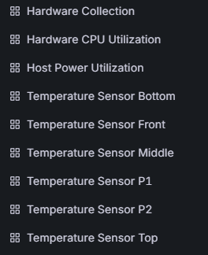
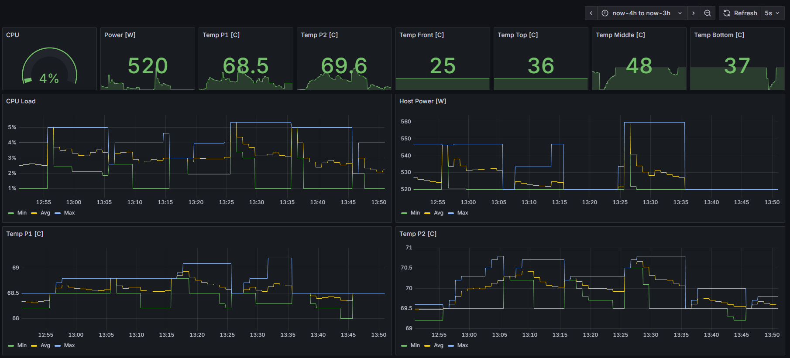

# imonitor

## Overview

Set of templates that can be used with [iserver](https://github.com/datacenter/iserver/) in order to bring up Grafana dashboard showing the metrics of the server collected from Intersight.

Components
- Intersight metrics polled and exposed to Prometheus using [Intersight OpenTelemetry](./intersight-otel/README.md)
- Grafana [dashboard](./dashboard/README.md) with Prometheus metrics

Check [automation procedure](./get_things_done.md) or step-by-step below.

## HowTo 

### Prerequisites

- [iserver](https://github.com/datacenter/iserver/) available
- access to OpenShift Cluster [defined](https://github.com/datacenter/iserver/blob/main/doc/ocp/Access.md)
- Intersight OpenTelemetry instance [deployed](https://github.com/datacenter/iserver/blob/main/doc/ocp/iotel/create_instance.md)
- Prometheus user-workload monitoring [enabled](https://github.com/datacenter/iserver/blob/main/doc/ocp/prometheus/enable_monitoring.md)
- Grafana operator [installed](https://github.com/datacenter/iserver/blob/main/doc/ocp/grafana/create_operator.md) and instance [created](https://github.com/datacenter/iserver/blob/main/doc/ocp/grafana/create_instance.md)

### From server metrics to grafana dashboard

- Step 1: define Intersight metrics [polling](./intersight-otel/README.md)
- Step 2: create Dashboard from [template](./dashboard/README.md)
- Step 3: enjoy the outcome

### Outcome

