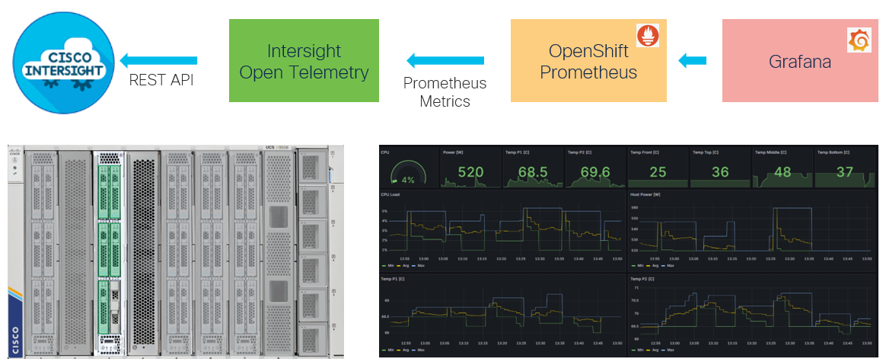

# Intersight OpenTelemetry

## Overview

[intersight-otel tool](https://github.com/cgascoig/intersight-otel) makes Cisco Intersight API requests and generate OpenTelemetry metrics from the responses.



[iserver](https://github.com/datacenter/iserver/blob/main/doc/ocp/iotel/README.md) makes it easier to use and provides
- intersight-otel deployment in OpenShift
- OpenShift Prometheus integration
- Intersight Server Discovery integration for pollers generation from templates

Refer to Intersight [metrics explorer](https://intersight.com/help/saas/monitoring/monitoring_metrics_explorer#overview) documentation for details since whatever intersight-otel or iserver is doing, is based on Intersight features in the first place. Be also aware to metrics may have UCS hardware dependency as well as IMM domain dependency.

## Pollers template 

The repo contains pollers template definition that can be used with iserver. Each template have two key parameters:
- DEVICE_ID that is Intersight device registration moid used to construct Intersight REST API that gets the metric
- SCOPE that is added to Prometheus metric to provide a context to the metric value

These parameters are automatically resolved based on the server defined in --target parameter with optional extra --attribute values.

You can add/modify the pollers. Just follow few simple rules
- keep directories flat i.e. precisely one directory for single poller.txt file
- keep poller definition in pollers.txt filename, engine is looking for the exact file name in the subdirectories selected with --template parameter
- subdirectory name (with pollers.txt) can be any however having some structure allows you later on to select the range of pollers e.g. --template hw.temp.*
- keep variable names if you want them to be resolved

## HowTo

Notes:
- the goal is to configure intersight-otel application deployed in OpenShift cluster using iserver with the set of pollers template
- the generated definitions can be added to existing pollers configuration or replace the pollers definition as per 'pmode' parameter
- the intersight-otel application referred by --suffix must be already deployed on OpenShift cluster selected with --cluster
- remember that intersight-otel instance is configured with Intersight REST API credentials to get access to specific group of servers
- dir is the local filesystem location of the cloned repo (this repo) that can be further modified if needed by you to have some extra or changed pollers
- template is the selector of the subdirectory inside --dir that supports wildcard (*) match
- multiple templates can be defined
- target defines the servers in Intersight for which the metric will be collected and put into Prometheus
- supported target format
    - server-name:exact-server-name e.g. --target server-name:my-server-123
    - server-ip:imc-ipv4-address e.g. --target server-ip:10.10.10.10
    - server-ip:imc-ipv4-address-range e.g. --target server-ip:10.10.10.10-20
    - server-ip:imc-ipv4-cidr e.g. --target server-ip:10.10.10.0/24
    - ocp:cluster-name as defined in [ocp access](https://github.com/datacenter/iserver/blob/main/doc/ocp/Access.md) e.g. --target ocp:bm1
- multiple targets can be defined

```
# iserver set ocp iotel --mode poller
  --cluster TEXT            Cluster Name
  --suffix TEXT             Resources name suffix
  --dir TEXT                Template directory
  --template TEXT           Poller template
  --target TEXT             Target server
  --attribute TEXT          Extra metric attributes
  --pmode [add|set]         Pollers modification mode  [default: add]
  --no-confirm              Confirmation mode
```

## Example

```
# iserver set ocp iotel --cluster bm1 --suffix iac --mode poller --template hw.temp.* --target server-ip:10.10.10.20-23 --pmode add --dir C:\tmp\imonitor\intersight-otel\ --no-confirm
```

Assumptions
- this repository cloned to C:\tmp
- cluster bm1 [defined](https://github.com/datacenter/iserver/blob/main/doc/ocp/Access.md)
- iotel instance iac [created](https://github.com/datacenter/iserver/blob/main/doc/ocp/iotel/create_instance.md)

Workflow
- list C:\tmp\imonitor\intersight-otel\ directory
- select subdirectories with pollers.txt file that match hw.temp.* target pattern
- collect from Intersight the selected servers' details
- generate selected pollers for every server
- update (add) the new pollers to already existing pollers in iotel instance
- restart iotel instance

```
# iserver set ocp iotel --cluster bm1 --suffix iac --mode poller --template hw.temp.* --target server-ip:10.10.10.20-23 --pmode add --dir C:\tmp\imonitor\intersight-otel\ --no-confirm

OpenShift Workflow - Intersight Open Telemetry (iotel) - Set Poller
===================================================================

OpenShift Cluster: bm1
Collect resources
- deployment
- secret
- config map

Instance
--------
- deployment intersight-otel/instance-iac
- config map intersight-otel/intersight-iac
- mode: set
- template: hw.temp.*
- target: server-ip:10.10.10.21-23
- empty user-provided poller

Select servers...
Collect server api objects [20]...
Selected servers: 20

Resolving intersight ids
------------------------
Server IP: 10.10.10.21-23

~~~
otel_collector_endpoint = "http://127.0.0.1:4317"


[[tspollers]]
name = "hw_temp_bottom_avg"
datasource = "PhysicalEntities"
dimensions = []
filter = { type = "and", fields = [{type = "selector", dimension = "instrument.name", value = "hw.temperature"}, {type = "selector", dimension = "hw.temperature.sensor.name", value = "TEMP_REAR_BOT"}, {type = "selector", dimension = "name", value = "TEMP_REAR_BOT"}, {type = "selector", dimension = "intersight.asset.device_registration.moid", value = "111111"}]}
aggregations = [{type = "longSum", name = "count", fieldName = "hw.temperature_count"}, {type = "doubleSum", name = "hw.temperature-Sum", fieldName = "hw.temperature"}]
post_aggregations = [{"type" = "expression", "name" = "intersight.hw.temp.bottom.avg", "expression" = "(\"hw.temperature-Sum\" / \"count\")"}]
field_names = ["intersight.hw.temp.bottom.avg"]
otel_dimension_to_attribute_map = { }
otel_attributes = { server-name = "server1", server-ip = "10.10.10.21" }
interval = 60

[[tspollers]]
name = "hw_temp_bottom_min"
datasource = "PhysicalEntities"
dimensions = []
filter = { type = "and", fields = [{type = "selector", dimension = "instrument.name", value = "hw.temperature"}, {type = "selector", dimension = "hw.temperature.sensor.name", value = "TEMP_REAR_BOT"}, {type = "selector", dimension = "name", value = "TEMP_REAR_BOT"}, {type = "selector", dimension = "intersight.asset.device_registration.moid", value = "111111"}]}
aggregations = [{type = "doubleMin", name = "intersight.hw.temp.bottom.min", fieldName = "hw.temperature_min"}]
post_aggregations = []
field_names = ["intersight.hw.temp.bottom.min"]
otel_dimension_to_attribute_map = { }
otel_attributes = { server-name = "server1", server-ip = "10.10.10.21" }
interval = 60

[[tspollers]]
name = "hw_temp_bottom_max"
datasource = "PhysicalEntities"
dimensions = []
filter = { type = "and", fields = [{type = "selector", dimension = "instrument.name", value = "hw.temperature"}, {type = "selector", dimension = "hw.temperature.sensor.name", value = "TEMP_REAR_BOT"}, {type = "selector", dimension = "name", value = "TEMP_REAR_BOT"}, {type = "selector", dimension = "intersight.asset.device_registration.moid", value = "111111"}]}
aggregations = [{type = "doubleMax", name = "intersight.hw.temp.bottom.max", fieldName = "hw.temperature_max"}]
post_aggregations = []
field_names = ["intersight.hw.temp.bottom.max"]
otel_dimension_to_attribute_map = { }
otel_attributes = { server-name = "server1", server-ip = "10.10.10.21" }
interval = 60
[[tspollers]]
name = "hw_temp_bottom_avg"
datasource = "PhysicalEntities"
dimensions = []
filter = { type = "and", fields = [{type = "selector", dimension = "instrument.name", value = "hw.temperature"}, {type = "selector", dimension = "hw.temperature.sensor.name", value = "TEMP_REAR_BOT"}, {type = "selector", dimension = "name", value = "TEMP_REAR_BOT"}, {type = "selector", dimension = "intersight.asset.device_registration.moid", value = "222222"}]}
aggregations = [{type = "longSum", name = "count", fieldName = "hw.temperature_count"}, {type = "doubleSum", name = "hw.temperature-Sum", fieldName = "hw.temperature"}]
post_aggregations = [{"type" = "expression", "name" = "intersight.hw.temp.bottom.avg", "expression" = "(\"hw.temperature-Sum\" / \"count\")"}]
field_names = ["intersight.hw.temp.bottom.avg"]
otel_dimension_to_attribute_map = { }
otel_attributes = { server-name = "server2", server-ip = "10.10.10.22" }
interval = 60

[[tspollers]]
name = "hw_temp_bottom_min"
datasource = "PhysicalEntities"
dimensions = []
filter = { type = "and", fields = [{type = "selector", dimension = "instrument.name", value = "hw.temperature"}, {type = "selector", dimension = "hw.temperature.sensor.name", value = "TEMP_REAR_BOT"}, {type = "selector", dimension = "name", value = "TEMP_REAR_BOT"}, {type = "selector", dimension = "intersight.asset.device_registration.moid", value = "222222"}]}
aggregations = [{type = "doubleMin", name = "intersight.hw.temp.bottom.min", fieldName = "hw.temperature_min"}]
post_aggregations = []
field_names = ["intersight.hw.temp.bottom.min"]
otel_dimension_to_attribute_map = { }
otel_attributes = { server-name = "server2", server-ip = "10.10.10.22" }
interval = 60

[[tspollers]]
name = "hw_temp_bottom_max"
datasource = "PhysicalEntities"
dimensions = []
filter = { type = "and", fields = [{type = "selector", dimension = "instrument.name", value = "hw.temperature"}, {type = "selector", dimension = "hw.temperature.sensor.name", value = "TEMP_REAR_BOT"}, {type = "selector", dimension = "name", value = "TEMP_REAR_BOT"}, {type = "selector", dimension = "intersight.asset.device_registration.moid", value = "222222"}]}
aggregations = [{type = "doubleMax", name = "intersight.hw.temp.bottom.max", fieldName = "hw.temperature_max"}]
post_aggregations = []
field_names = ["intersight.hw.temp.bottom.max"]
otel_dimension_to_attribute_map = { }
otel_attributes = { server-name = "server2", server-ip = "10.10.10.22" }
interval = 60
[[tspollers]]
name = "hw_temp_bottom_avg"
datasource = "PhysicalEntities"
dimensions = []
filter = { type = "and", fields = [{type = "selector", dimension = "instrument.name", value = "hw.temperature"}, {type = "selector", dimension = "hw.temperature.sensor.name", value = "TEMP_REAR_BOT"}, {type = "selector", dimension = "name", value = "TEMP_REAR_BOT"}, {type = "selector", dimension = "intersight.asset.device_registration.moid", value = "333333"}]}
aggregations = [{type = "longSum", name = "count", fieldName = "hw.temperature_count"}, {type = "doubleSum", name = "hw.temperature-Sum", fieldName = "hw.temperature"}]
post_aggregations = [{"type" = "expression", "name" = "intersight.hw.temp.bottom.avg", "expression" = "(\"hw.temperature-Sum\" / \"count\")"}]
field_names = ["intersight.hw.temp.bottom.avg"]
otel_dimension_to_attribute_map = { }
otel_attributes = { server-name = "server3", server-ip = "10.10.10.23" }
interval = 60

[[tspollers]]
name = "hw_temp_bottom_min"
datasource = "PhysicalEntities"
dimensions = []
filter = { type = "and", fields = [{type = "selector", dimension = "instrument.name", value = "hw.temperature"}, {type = "selector", dimension = "hw.temperature.sensor.name", value = "TEMP_REAR_BOT"}, {type = "selector", dimension = "name", value = "TEMP_REAR_BOT"}, {type = "selector", dimension = "intersight.asset.device_registration.moid", value = "333333"}]}
aggregations = [{type = "doubleMin", name = "intersight.hw.temp.bottom.min", fieldName = "hw.temperature_min"}]
post_aggregations = []
field_names = ["intersight.hw.temp.bottom.min"]
otel_dimension_to_attribute_map = { }
otel_attributes = { server-name = "server3", server-ip = "10.10.10.23" }
interval = 60

[[tspollers]]
name = "hw_temp_bottom_max"
datasource = "PhysicalEntities"
dimensions = []
filter = { type = "and", fields = [{type = "selector", dimension = "instrument.name", value = "hw.temperature"}, {type = "selector", dimension = "hw.temperature.sensor.name", value = "TEMP_REAR_BOT"}, {type = "selector", dimension = "name", value = "TEMP_REAR_BOT"}, {type = "selector", dimension = "intersight.asset.device_registration.moid", value = "333333"}]}
aggregations = [{type = "doubleMax", name = "intersight.hw.temp.bottom.max", fieldName = "hw.temperature_max"}]
post_aggregations = []
field_names = ["intersight.hw.temp.bottom.max"]
otel_dimension_to_attribute_map = { }
otel_attributes = { server-name = "server3", server-ip = "10.10.10.23" }
interval = 60
[[tspollers]]
name = "hw_temp_front_avg"
datasource = "PhysicalEntities"
dimensions = []
filter = { type = "and", fields = [{type = "selector", dimension = "instrument.name", value = "hw.temperature"}, {type = "selector", dimension = "hw.temperature.sensor.name", value = "TEMP_FRONT"}, {type = "selector", dimension = "name", value = "TEMP_FRONT"}, {type = "selector", dimension = "intersight.asset.device_registration.moid", value = "111111"}]}
aggregations = [{type = "longSum", name = "count", fieldName = "hw.temperature_count"}, {type = "doubleSum", name = "hw.temperature-Sum", fieldName = "hw.temperature"}]
post_aggregations = [{"type" = "expression", "name" = "intersight.hw.temp.front.avg", "expression" = "(\"hw.temperature-Sum\" / \"count\")"}]
field_names = ["intersight.hw.temp.front.avg"]
otel_dimension_to_attribute_map = { }
otel_attributes = { server-name = "server1", server-ip = "10.10.10.21" }
interval = 60

[[tspollers]]
name = "hw_temp_front_min"
datasource = "PhysicalEntities"
dimensions = []
filter = { type = "and", fields = [{type = "selector", dimension = "instrument.name", value = "hw.temperature"}, {type = "selector", dimension = "hw.temperature.sensor.name", value = "TEMP_FRONT"}, {type = "selector", dimension = "name", value = "TEMP_FRONT"}, {type = "selector", dimension = "intersight.asset.device_registration.moid", value = "111111"}]}
aggregations = [{type = "doubleMin", name = "intersight.hw.temp.front.min", fieldName = "hw.temperature_min"}]
post_aggregations = []
field_names = ["intersight.hw.temp.front.min"]
otel_dimension_to_attribute_map = { }
otel_attributes = { server-name = "server1", server-ip = "10.10.10.21" }
interval = 60

[[tspollers]]
name = "hw_temp_front_max"
datasource = "PhysicalEntities"
dimensions = []
filter = { type = "and", fields = [{type = "selector", dimension = "instrument.name", value = "hw.temperature"}, {type = "selector", dimension = "hw.temperature.sensor.name", value = "TEMP_FRONT"}, {type = "selector", dimension = "name", value = "TEMP_FRONT"}, {type = "selector", dimension = "intersight.asset.device_registration.moid", value = "111111"}]}
aggregations = [{type = "doubleMax", name = "intersight.hw.temp.front.max", fieldName = "hw.temperature_max"}]
post_aggregations = []
field_names = ["intersight.hw.temp.front.max"]
otel_dimension_to_attribute_map = { }
otel_attributes = { server-name = "server1", server-ip = "10.10.10.21" }
interval = 60
[[tspollers]]
name = "hw_temp_front_avg"
datasource = "PhysicalEntities"
dimensions = []
filter = { type = "and", fields = [{type = "selector", dimension = "instrument.name", value = "hw.temperature"}, {type = "selector", dimension = "hw.temperature.sensor.name", value = "TEMP_FRONT"}, {type = "selector", dimension = "name", value = "TEMP_FRONT"}, {type = "selector", dimension = "intersight.asset.device_registration.moid", value = "222222"}]}
aggregations = [{type = "longSum", name = "count", fieldName = "hw.temperature_count"}, {type = "doubleSum", name = "hw.temperature-Sum", fieldName = "hw.temperature"}]
post_aggregations = [{"type" = "expression", "name" = "intersight.hw.temp.front.avg", "expression" = "(\"hw.temperature-Sum\" / \"count\")"}]
field_names = ["intersight.hw.temp.front.avg"]
otel_dimension_to_attribute_map = { }
otel_attributes = { server-name = "server2", server-ip = "10.10.10.22" }
interval = 60

[[tspollers]]
name = "hw_temp_front_min"
datasource = "PhysicalEntities"
dimensions = []
filter = { type = "and", fields = [{type = "selector", dimension = "instrument.name", value = "hw.temperature"}, {type = "selector", dimension = "hw.temperature.sensor.name", value = "TEMP_FRONT"}, {type = "selector", dimension = "name", value = "TEMP_FRONT"}, {type = "selector", dimension = "intersight.asset.device_registration.moid", value = "222222"}]}
aggregations = [{type = "doubleMin", name = "intersight.hw.temp.front.min", fieldName = "hw.temperature_min"}]
post_aggregations = []
field_names = ["intersight.hw.temp.front.min"]
otel_dimension_to_attribute_map = { }
otel_attributes = { server-name = "server2", server-ip = "10.10.10.22" }
interval = 60

[[tspollers]]
name = "hw_temp_front_max"
datasource = "PhysicalEntities"
dimensions = []
filter = { type = "and", fields = [{type = "selector", dimension = "instrument.name", value = "hw.temperature"}, {type = "selector", dimension = "hw.temperature.sensor.name", value = "TEMP_FRONT"}, {type = "selector", dimension = "name", value = "TEMP_FRONT"}, {type = "selector", dimension = "intersight.asset.device_registration.moid", value = "222222"}]}
aggregations = [{type = "doubleMax", name = "intersight.hw.temp.front.max", fieldName = "hw.temperature_max"}]
post_aggregations = []
field_names = ["intersight.hw.temp.front.max"]
otel_dimension_to_attribute_map = { }
otel_attributes = { server-name = "server2", server-ip = "10.10.10.22" }
interval = 60
[[tspollers]]
name = "hw_temp_front_avg"
datasource = "PhysicalEntities"
dimensions = []
filter = { type = "and", fields = [{type = "selector", dimension = "instrument.name", value = "hw.temperature"}, {type = "selector", dimension = "hw.temperature.sensor.name", value = "TEMP_FRONT"}, {type = "selector", dimension = "name", value = "TEMP_FRONT"}, {type = "selector", dimension = "intersight.asset.device_registration.moid", value = "333333"}]}
aggregations = [{type = "longSum", name = "count", fieldName = "hw.temperature_count"}, {type = "doubleSum", name = "hw.temperature-Sum", fieldName = "hw.temperature"}]
post_aggregations = [{"type" = "expression", "name" = "intersight.hw.temp.front.avg", "expression" = "(\"hw.temperature-Sum\" / \"count\")"}]
field_names = ["intersight.hw.temp.front.avg"]
otel_dimension_to_attribute_map = { }
otel_attributes = { server-name = "server3", server-ip = "10.10.10.23" }
interval = 60

[[tspollers]]
name = "hw_temp_front_min"
datasource = "PhysicalEntities"
dimensions = []
filter = { type = "and", fields = [{type = "selector", dimension = "instrument.name", value = "hw.temperature"}, {type = "selector", dimension = "hw.temperature.sensor.name", value = "TEMP_FRONT"}, {type = "selector", dimension = "name", value = "TEMP_FRONT"}, {type = "selector", dimension = "intersight.asset.device_registration.moid", value = "333333"}]}
aggregations = [{type = "doubleMin", name = "intersight.hw.temp.front.min", fieldName = "hw.temperature_min"}]
post_aggregations = []
field_names = ["intersight.hw.temp.front.min"]
otel_dimension_to_attribute_map = { }
otel_attributes = { server-name = "server3", server-ip = "10.10.10.23" }
interval = 60

[[tspollers]]
name = "hw_temp_front_max"
datasource = "PhysicalEntities"
dimensions = []
filter = { type = "and", fields = [{type = "selector", dimension = "instrument.name", value = "hw.temperature"}, {type = "selector", dimension = "hw.temperature.sensor.name", value = "TEMP_FRONT"}, {type = "selector", dimension = "name", value = "TEMP_FRONT"}, {type = "selector", dimension = "intersight.asset.device_registration.moid", value = "333333"}]}
aggregations = [{type = "doubleMax", name = "intersight.hw.temp.front.max", fieldName = "hw.temperature_max"}]
post_aggregations = []
field_names = ["intersight.hw.temp.front.max"]
otel_dimension_to_attribute_map = { }
otel_attributes = { server-name = "server3", server-ip = "10.10.10.23" }
interval = 60
[[tspollers]]
name = "hw_temp_middle_avg"
datasource = "PhysicalEntities"
dimensions = []
filter = { type = "and", fields = [{type = "selector", dimension = "instrument.name", value = "hw.temperature"}, {type = "selector", dimension = "hw.temperature.sensor.name", value = "TEMP_REAR_MID"}, {type = "selector", dimension = "name", value = "TEMP_REAR_MID"}, {type = "selector", dimension = "intersight.asset.device_registration.moid", value = "111111"}]}
aggregations = [{type = "longSum", name = "count", fieldName = "hw.temperature_count"}, {type = "doubleSum", name = "hw.temperature-Sum", fieldName = "hw.temperature"}]
post_aggregations = [{"type" = "expression", "name" = "intersight.hw.temp.middle.avg", "expression" = "(\"hw.temperature-Sum\" / \"count\")"}]
field_names = ["intersight.hw.temp.middle.avg"]
otel_dimension_to_attribute_map = { }
otel_attributes = { server-name = "server1", server-ip = "10.10.10.21" }
interval = 60

[[tspollers]]
name = "hw_temp_middle_min"
datasource = "PhysicalEntities"
dimensions = []
filter = { type = "and", fields = [{type = "selector", dimension = "instrument.name", value = "hw.temperature"}, {type = "selector", dimension = "hw.temperature.sensor.name", value = "TEMP_REAR_MID"}, {type = "selector", dimension = "name", value = "TEMP_REAR_MID"}, {type = "selector", dimension = "intersight.asset.device_registration.moid", value = "111111"}]}
aggregations = [{type = "doubleMin", name = "intersight.hw.temp.middle.min", fieldName = "hw.temperature_min"}]
post_aggregations = []
field_names = ["intersight.hw.temp.middle.min"]
otel_dimension_to_attribute_map = { }
otel_attributes = { server-name = "server1", server-ip = "10.10.10.21" }
interval = 60

[[tspollers]]
name = "hw_temp_middle_max"
datasource = "PhysicalEntities"
dimensions = []
filter = { type = "and", fields = [{type = "selector", dimension = "instrument.name", value = "hw.temperature"}, {type = "selector", dimension = "hw.temperature.sensor.name", value = "TEMP_REAR_MID"}, {type = "selector", dimension = "name", value = "TEMP_REAR_MID"}, {type = "selector", dimension = "intersight.asset.device_registration.moid", value = "111111"}]}
aggregations = [{type = "doubleMax", name = "intersight.hw.temp.middle.max", fieldName = "hw.temperature_max"}]
post_aggregations = []
field_names = ["intersight.hw.temp.middle.max"]
otel_dimension_to_attribute_map = { }
otel_attributes = { server-name = "server1", server-ip = "10.10.10.21" }
interval = 60
[[tspollers]]
name = "hw_temp_middle_avg"
datasource = "PhysicalEntities"
dimensions = []
filter = { type = "and", fields = [{type = "selector", dimension = "instrument.name", value = "hw.temperature"}, {type = "selector", dimension = "hw.temperature.sensor.name", value = "TEMP_REAR_MID"}, {type = "selector", dimension = "name", value = "TEMP_REAR_MID"}, {type = "selector", dimension = "intersight.asset.device_registration.moid", value = "222222"}]}
aggregations = [{type = "longSum", name = "count", fieldName = "hw.temperature_count"}, {type = "doubleSum", name = "hw.temperature-Sum", fieldName = "hw.temperature"}]
post_aggregations = [{"type" = "expression", "name" = "intersight.hw.temp.middle.avg", "expression" = "(\"hw.temperature-Sum\" / \"count\")"}]
field_names = ["intersight.hw.temp.middle.avg"]
otel_dimension_to_attribute_map = { }
otel_attributes = { server-name = "server2", server-ip = "10.10.10.22" }
interval = 60

[[tspollers]]
name = "hw_temp_middle_min"
datasource = "PhysicalEntities"
dimensions = []
filter = { type = "and", fields = [{type = "selector", dimension = "instrument.name", value = "hw.temperature"}, {type = "selector", dimension = "hw.temperature.sensor.name", value = "TEMP_REAR_MID"}, {type = "selector", dimension = "name", value = "TEMP_REAR_MID"}, {type = "selector", dimension = "intersight.asset.device_registration.moid", value = "222222"}]}
aggregations = [{type = "doubleMin", name = "intersight.hw.temp.middle.min", fieldName = "hw.temperature_min"}]
post_aggregations = []
field_names = ["intersight.hw.temp.middle.min"]
otel_dimension_to_attribute_map = { }
otel_attributes = { server-name = "server2", server-ip = "10.10.10.22" }
interval = 60

[[tspollers]]
name = "hw_temp_middle_max"
datasource = "PhysicalEntities"
dimensions = []
filter = { type = "and", fields = [{type = "selector", dimension = "instrument.name", value = "hw.temperature"}, {type = "selector", dimension = "hw.temperature.sensor.name", value = "TEMP_REAR_MID"}, {type = "selector", dimension = "name", value = "TEMP_REAR_MID"}, {type = "selector", dimension = "intersight.asset.device_registration.moid", value = "222222"}]}
aggregations = [{type = "doubleMax", name = "intersight.hw.temp.middle.max", fieldName = "hw.temperature_max"}]
post_aggregations = []
field_names = ["intersight.hw.temp.middle.max"]
otel_dimension_to_attribute_map = { }
otel_attributes = { server-name = "server2", server-ip = "10.10.10.22" }
interval = 60
[[tspollers]]
name = "hw_temp_middle_avg"
datasource = "PhysicalEntities"
dimensions = []
filter = { type = "and", fields = [{type = "selector", dimension = "instrument.name", value = "hw.temperature"}, {type = "selector", dimension = "hw.temperature.sensor.name", value = "TEMP_REAR_MID"}, {type = "selector", dimension = "name", value = "TEMP_REAR_MID"}, {type = "selector", dimension = "intersight.asset.device_registration.moid", value = "333333"}]}
aggregations = [{type = "longSum", name = "count", fieldName = "hw.temperature_count"}, {type = "doubleSum", name = "hw.temperature-Sum", fieldName = "hw.temperature"}]
post_aggregations = [{"type" = "expression", "name" = "intersight.hw.temp.middle.avg", "expression" = "(\"hw.temperature-Sum\" / \"count\")"}]
field_names = ["intersight.hw.temp.middle.avg"]
otel_dimension_to_attribute_map = { }
otel_attributes = { server-name = "server3", server-ip = "10.10.10.23" }
interval = 60

[[tspollers]]
name = "hw_temp_middle_min"
datasource = "PhysicalEntities"
dimensions = []
filter = { type = "and", fields = [{type = "selector", dimension = "instrument.name", value = "hw.temperature"}, {type = "selector", dimension = "hw.temperature.sensor.name", value = "TEMP_REAR_MID"}, {type = "selector", dimension = "name", value = "TEMP_REAR_MID"}, {type = "selector", dimension = "intersight.asset.device_registration.moid", value = "333333"}]}
aggregations = [{type = "doubleMin", name = "intersight.hw.temp.middle.min", fieldName = "hw.temperature_min"}]
post_aggregations = []
field_names = ["intersight.hw.temp.middle.min"]
otel_dimension_to_attribute_map = { }
otel_attributes = { server-name = "server3", server-ip = "10.10.10.23" }
interval = 60

[[tspollers]]
name = "hw_temp_middle_max"
datasource = "PhysicalEntities"
dimensions = []
filter = { type = "and", fields = [{type = "selector", dimension = "instrument.name", value = "hw.temperature"}, {type = "selector", dimension = "hw.temperature.sensor.name", value = "TEMP_REAR_MID"}, {type = "selector", dimension = "name", value = "TEMP_REAR_MID"}, {type = "selector", dimension = "intersight.asset.device_registration.moid", value = "333333"}]}
aggregations = [{type = "doubleMax", name = "intersight.hw.temp.middle.max", fieldName = "hw.temperature_max"}]
post_aggregations = []
field_names = ["intersight.hw.temp.middle.max"]
otel_dimension_to_attribute_map = { }
otel_attributes = { server-name = "server3", server-ip = "10.10.10.23" }
interval = 60
[[tspollers]]
name = "hw_temp_p1_avg"
datasource = "PhysicalEntities"
dimensions = []
filter = { type = "and", fields = [{type = "selector", dimension = "instrument.name", value = "hw.temperature"}, {type = "selector", dimension = "hw.temperature.sensor.name", value = "P1_TEMP_SENS"}, {type = "selector", dimension = "name", value = "P1_TEMP_SENS"}, {type = "selector", dimension = "intersight.asset.device_registration.moid", value = "111111"}]}
aggregations = [{type = "longSum", name = "count", fieldName = "hw.temperature_count"}, {type = "doubleSum", name = "hw.temperature-Sum", fieldName = "hw.temperature"}]
post_aggregations = [{"type" = "expression", "name" = "intersight.hw.temp.p1.avg", "expression" = "(\"hw.temperature-Sum\" / \"count\")"}]
field_names = ["intersight.hw.temp.p1.avg"]
otel_dimension_to_attribute_map = { }
otel_attributes = { server-name = "server1", server-ip = "10.10.10.21" }
interval = 60

[[tspollers]]
name = "hw_temp_p1_min"
datasource = "PhysicalEntities"
dimensions = []
filter = { type = "and", fields = [{type = "selector", dimension = "instrument.name", value = "hw.temperature"}, {type = "selector", dimension = "hw.temperature.sensor.name", value = "P1_TEMP_SENS"}, {type = "selector", dimension = "name", value = "P1_TEMP_SENS"}, {type = "selector", dimension = "intersight.asset.device_registration.moid", value = "111111"}]}
aggregations = [{type = "doubleMin", name = "intersight.hw.temp.p1.min", fieldName = "hw.temperature_min"}]
post_aggregations = []
field_names = ["intersight.hw.temp.p1.min"]
otel_dimension_to_attribute_map = { }
otel_attributes = { server-name = "server1", server-ip = "10.10.10.21" }
interval = 60

[[tspollers]]
name = "hw_temp_p1_max"
datasource = "PhysicalEntities"
dimensions = []
filter = { type = "and", fields = [{type = "selector", dimension = "instrument.name", value = "hw.temperature"}, {type = "selector", dimension = "hw.temperature.sensor.name", value = "P1_TEMP_SENS"}, {type = "selector", dimension = "name", value = "P1_TEMP_SENS"}, {type = "selector", dimension = "intersight.asset.device_registration.moid", value = "111111"}]}
aggregations = [{type = "doubleMax", name = "intersight.hw.temp.p1.max", fieldName = "hw.temperature_max"}]
post_aggregations = []
field_names = ["intersight.hw.temp.p1.max"]
otel_dimension_to_attribute_map = { }
otel_attributes = { server-name = "server1", server-ip = "10.10.10.21" }
interval = 60
[[tspollers]]
name = "hw_temp_p1_avg"
datasource = "PhysicalEntities"
dimensions = []
filter = { type = "and", fields = [{type = "selector", dimension = "instrument.name", value = "hw.temperature"}, {type = "selector", dimension = "hw.temperature.sensor.name", value = "P1_TEMP_SENS"}, {type = "selector", dimension = "name", value = "P1_TEMP_SENS"}, {type = "selector", dimension = "intersight.asset.device_registration.moid", value = "222222"}]}
aggregations = [{type = "longSum", name = "count", fieldName = "hw.temperature_count"}, {type = "doubleSum", name = "hw.temperature-Sum", fieldName = "hw.temperature"}]
post_aggregations = [{"type" = "expression", "name" = "intersight.hw.temp.p1.avg", "expression" = "(\"hw.temperature-Sum\" / \"count\")"}]
field_names = ["intersight.hw.temp.p1.avg"]
otel_dimension_to_attribute_map = { }
otel_attributes = { server-name = "server2", server-ip = "10.10.10.22" }
interval = 60

[[tspollers]]
name = "hw_temp_p1_min"
datasource = "PhysicalEntities"
dimensions = []
filter = { type = "and", fields = [{type = "selector", dimension = "instrument.name", value = "hw.temperature"}, {type = "selector", dimension = "hw.temperature.sensor.name", value = "P1_TEMP_SENS"}, {type = "selector", dimension = "name", value = "P1_TEMP_SENS"}, {type = "selector", dimension = "intersight.asset.device_registration.moid", value = "222222"}]}
aggregations = [{type = "doubleMin", name = "intersight.hw.temp.p1.min", fieldName = "hw.temperature_min"}]
post_aggregations = []
field_names = ["intersight.hw.temp.p1.min"]
otel_dimension_to_attribute_map = { }
otel_attributes = { server-name = "server2", server-ip = "10.10.10.22" }
interval = 60

[[tspollers]]
name = "hw_temp_p1_max"
datasource = "PhysicalEntities"
dimensions = []
filter = { type = "and", fields = [{type = "selector", dimension = "instrument.name", value = "hw.temperature"}, {type = "selector", dimension = "hw.temperature.sensor.name", value = "P1_TEMP_SENS"}, {type = "selector", dimension = "name", value = "P1_TEMP_SENS"}, {type = "selector", dimension = "intersight.asset.device_registration.moid", value = "222222"}]}
aggregations = [{type = "doubleMax", name = "intersight.hw.temp.p1.max", fieldName = "hw.temperature_max"}]
post_aggregations = []
field_names = ["intersight.hw.temp.p1.max"]
otel_dimension_to_attribute_map = { }
otel_attributes = { server-name = "server2", server-ip = "10.10.10.22" }
interval = 60
[[tspollers]]
name = "hw_temp_p1_avg"
datasource = "PhysicalEntities"
dimensions = []
filter = { type = "and", fields = [{type = "selector", dimension = "instrument.name", value = "hw.temperature"}, {type = "selector", dimension = "hw.temperature.sensor.name", value = "P1_TEMP_SENS"}, {type = "selector", dimension = "name", value = "P1_TEMP_SENS"}, {type = "selector", dimension = "intersight.asset.device_registration.moid", value = "333333"}]}
aggregations = [{type = "longSum", name = "count", fieldName = "hw.temperature_count"}, {type = "doubleSum", name = "hw.temperature-Sum", fieldName = "hw.temperature"}]
post_aggregations = [{"type" = "expression", "name" = "intersight.hw.temp.p1.avg", "expression" = "(\"hw.temperature-Sum\" / \"count\")"}]
field_names = ["intersight.hw.temp.p1.avg"]
otel_dimension_to_attribute_map = { }
otel_attributes = { server-name = "server3", server-ip = "10.10.10.23" }
interval = 60

[[tspollers]]
name = "hw_temp_p1_min"
datasource = "PhysicalEntities"
dimensions = []
filter = { type = "and", fields = [{type = "selector", dimension = "instrument.name", value = "hw.temperature"}, {type = "selector", dimension = "hw.temperature.sensor.name", value = "P1_TEMP_SENS"}, {type = "selector", dimension = "name", value = "P1_TEMP_SENS"}, {type = "selector", dimension = "intersight.asset.device_registration.moid", value = "333333"}]}
aggregations = [{type = "doubleMin", name = "intersight.hw.temp.p1.min", fieldName = "hw.temperature_min"}]
post_aggregations = []
field_names = ["intersight.hw.temp.p1.min"]
otel_dimension_to_attribute_map = { }
otel_attributes = { server-name = "server3", server-ip = "10.10.10.23" }
interval = 60

[[tspollers]]
name = "hw_temp_p1_max"
datasource = "PhysicalEntities"
dimensions = []
filter = { type = "and", fields = [{type = "selector", dimension = "instrument.name", value = "hw.temperature"}, {type = "selector", dimension = "hw.temperature.sensor.name", value = "P1_TEMP_SENS"}, {type = "selector", dimension = "name", value = "P1_TEMP_SENS"}, {type = "selector", dimension = "intersight.asset.device_registration.moid", value = "333333"}]}
aggregations = [{type = "doubleMax", name = "intersight.hw.temp.p1.max", fieldName = "hw.temperature_max"}]
post_aggregations = []
field_names = ["intersight.hw.temp.p1.max"]
otel_dimension_to_attribute_map = { }
otel_attributes = { server-name = "server3", server-ip = "10.10.10.23" }
interval = 60
[[tspollers]]
name = "hw_temp_p2_avg"
datasource = "PhysicalEntities"
dimensions = []
filter = { type = "and", fields = [{type = "selector", dimension = "instrument.name", value = "hw.temperature"}, {type = "selector", dimension = "hw.temperature.sensor.name", value = "P2_TEMP_SENS"}, {type = "selector", dimension = "name", value = "P2_TEMP_SENS"}, {type = "selector", dimension = "intersight.asset.device_registration.moid", value = "111111"}]}
aggregations = [{type = "longSum", name = "count", fieldName = "hw.temperature_count"}, {type = "doubleSum", name = "hw.temperature-Sum", fieldName = "hw.temperature"}]
post_aggregations = [{"type" = "expression", "name" = "intersight.hw.temp.p2.avg", "expression" = "(\"hw.temperature-Sum\" / \"count\")"}]
field_names = ["intersight.hw.temp.p2.avg"]
otel_dimension_to_attribute_map = { }
otel_attributes = { server-name = "server1", server-ip = "10.10.10.21" }
interval = 60

[[tspollers]]
name = "hw_temp_p2_min"
datasource = "PhysicalEntities"
dimensions = []
filter = { type = "and", fields = [{type = "selector", dimension = "instrument.name", value = "hw.temperature"}, {type = "selector", dimension = "hw.temperature.sensor.name", value = "P2_TEMP_SENS"}, {type = "selector", dimension = "name", value = "P2_TEMP_SENS"}, {type = "selector", dimension = "intersight.asset.device_registration.moid", value = "111111"}]}
aggregations = [{type = "doubleMin", name = "intersight.hw.temp.p2.min", fieldName = "hw.temperature_min"}]
post_aggregations = []
field_names = ["intersight.hw.temp.p2.min"]
otel_dimension_to_attribute_map = { }
otel_attributes = { server-name = "server1", server-ip = "10.10.10.21" }
interval = 60

[[tspollers]]
name = "hw_temp_p2_max"
datasource = "PhysicalEntities"
dimensions = []
filter = { type = "and", fields = [{type = "selector", dimension = "instrument.name", value = "hw.temperature"}, {type = "selector", dimension = "hw.temperature.sensor.name", value = "P2_TEMP_SENS"}, {type = "selector", dimension = "name", value = "P2_TEMP_SENS"}, {type = "selector", dimension = "intersight.asset.device_registration.moid", value = "111111"}]}
aggregations = [{type = "doubleMax", name = "intersight.hw.temp.p2.max", fieldName = "hw.temperature_max"}]
post_aggregations = []
field_names = ["intersight.hw.temp.p2.max"]
otel_dimension_to_attribute_map = { }
otel_attributes = { server-name = "server1", server-ip = "10.10.10.21" }
interval = 60
[[tspollers]]
name = "hw_temp_p2_avg"
datasource = "PhysicalEntities"
dimensions = []
filter = { type = "and", fields = [{type = "selector", dimension = "instrument.name", value = "hw.temperature"}, {type = "selector", dimension = "hw.temperature.sensor.name", value = "P2_TEMP_SENS"}, {type = "selector", dimension = "name", value = "P2_TEMP_SENS"}, {type = "selector", dimension = "intersight.asset.device_registration.moid", value = "222222"}]}
aggregations = [{type = "longSum", name = "count", fieldName = "hw.temperature_count"}, {type = "doubleSum", name = "hw.temperature-Sum", fieldName = "hw.temperature"}]
post_aggregations = [{"type" = "expression", "name" = "intersight.hw.temp.p2.avg", "expression" = "(\"hw.temperature-Sum\" / \"count\")"}]
field_names = ["intersight.hw.temp.p2.avg"]
otel_dimension_to_attribute_map = { }
otel_attributes = { server-name = "server2", server-ip = "10.10.10.22" }
interval = 60

[[tspollers]]
name = "hw_temp_p2_min"
datasource = "PhysicalEntities"
dimensions = []
filter = { type = "and", fields = [{type = "selector", dimension = "instrument.name", value = "hw.temperature"}, {type = "selector", dimension = "hw.temperature.sensor.name", value = "P2_TEMP_SENS"}, {type = "selector", dimension = "name", value = "P2_TEMP_SENS"}, {type = "selector", dimension = "intersight.asset.device_registration.moid", value = "222222"}]}
aggregations = [{type = "doubleMin", name = "intersight.hw.temp.p2.min", fieldName = "hw.temperature_min"}]
post_aggregations = []
field_names = ["intersight.hw.temp.p2.min"]
otel_dimension_to_attribute_map = { }
otel_attributes = { server-name = "server2", server-ip = "10.10.10.22" }
interval = 60

[[tspollers]]
name = "hw_temp_p2_max"
datasource = "PhysicalEntities"
dimensions = []
filter = { type = "and", fields = [{type = "selector", dimension = "instrument.name", value = "hw.temperature"}, {type = "selector", dimension = "hw.temperature.sensor.name", value = "P2_TEMP_SENS"}, {type = "selector", dimension = "name", value = "P2_TEMP_SENS"}, {type = "selector", dimension = "intersight.asset.device_registration.moid", value = "222222"}]}
aggregations = [{type = "doubleMax", name = "intersight.hw.temp.p2.max", fieldName = "hw.temperature_max"}]
post_aggregations = []
field_names = ["intersight.hw.temp.p2.max"]
otel_dimension_to_attribute_map = { }
otel_attributes = { server-name = "server2", server-ip = "10.10.10.22" }
interval = 60
[[tspollers]]
name = "hw_temp_p2_avg"
datasource = "PhysicalEntities"
dimensions = []
filter = { type = "and", fields = [{type = "selector", dimension = "instrument.name", value = "hw.temperature"}, {type = "selector", dimension = "hw.temperature.sensor.name", value = "P2_TEMP_SENS"}, {type = "selector", dimension = "name", value = "P2_TEMP_SENS"}, {type = "selector", dimension = "intersight.asset.device_registration.moid", value = "333333"}]}
aggregations = [{type = "longSum", name = "count", fieldName = "hw.temperature_count"}, {type = "doubleSum", name = "hw.temperature-Sum", fieldName = "hw.temperature"}]
post_aggregations = [{"type" = "expression", "name" = "intersight.hw.temp.p2.avg", "expression" = "(\"hw.temperature-Sum\" / \"count\")"}]
field_names = ["intersight.hw.temp.p2.avg"]
otel_dimension_to_attribute_map = { }
otel_attributes = { server-name = "server3", server-ip = "10.10.10.23" }
interval = 60

[[tspollers]]
name = "hw_temp_p2_min"
datasource = "PhysicalEntities"
dimensions = []
filter = { type = "and", fields = [{type = "selector", dimension = "instrument.name", value = "hw.temperature"}, {type = "selector", dimension = "hw.temperature.sensor.name", value = "P2_TEMP_SENS"}, {type = "selector", dimension = "name", value = "P2_TEMP_SENS"}, {type = "selector", dimension = "intersight.asset.device_registration.moid", value = "333333"}]}
aggregations = [{type = "doubleMin", name = "intersight.hw.temp.p2.min", fieldName = "hw.temperature_min"}]
post_aggregations = []
field_names = ["intersight.hw.temp.p2.min"]
otel_dimension_to_attribute_map = { }
otel_attributes = { server-name = "server3", server-ip = "10.10.10.23" }
interval = 60

[[tspollers]]
name = "hw_temp_p2_max"
datasource = "PhysicalEntities"
dimensions = []
filter = { type = "and", fields = [{type = "selector", dimension = "instrument.name", value = "hw.temperature"}, {type = "selector", dimension = "hw.temperature.sensor.name", value = "P2_TEMP_SENS"}, {type = "selector", dimension = "name", value = "P2_TEMP_SENS"}, {type = "selector", dimension = "intersight.asset.device_registration.moid", value = "333333"}]}
aggregations = [{type = "doubleMax", name = "intersight.hw.temp.p2.max", fieldName = "hw.temperature_max"}]
post_aggregations = []
field_names = ["intersight.hw.temp.p2.max"]
otel_dimension_to_attribute_map = { }
otel_attributes = { server-name = "server3", server-ip = "10.10.10.23" }
interval = 60
[[tspollers]]
name = "hw_temp_top_avg"
datasource = "PhysicalEntities"
dimensions = []
filter = { type = "and", fields = [{type = "selector", dimension = "instrument.name", value = "hw.temperature"}, {type = "selector", dimension = "hw.temperature.sensor.name", value = "TEMP_REAR_TOP"}, {type = "selector", dimension = "name", value = "TEMP_REAR_TOP"}, {type = "selector", dimension = "intersight.asset.device_registration.moid", value = "111111"}]}
aggregations = [{type = "longSum", name = "count", fieldName = "hw.temperature_count"}, {type = "doubleSum", name = "hw.temperature-Sum", fieldName = "hw.temperature"}]
post_aggregations = [{"type" = "expression", "name" = "intersight.hw.temp.top.avg", "expression" = "(\"hw.temperature-Sum\" / \"count\")"}]
field_names = ["intersight.hw.temp.top.avg"]
otel_dimension_to_attribute_map = { }
otel_attributes = { server-name = "server1", server-ip = "10.10.10.21" }
interval = 60

[[tspollers]]
name = "hw_temp_top_min"
datasource = "PhysicalEntities"
dimensions = []
filter = { type = "and", fields = [{type = "selector", dimension = "instrument.name", value = "hw.temperature"}, {type = "selector", dimension = "hw.temperature.sensor.name", value = "TEMP_REAR_TOP"}, {type = "selector", dimension = "name", value = "TEMP_REAR_TOP"}, {type = "selector", dimension = "intersight.asset.device_registration.moid", value = "111111"}]}
aggregations = [{type = "doubleMin", name = "intersight.hw.temp.top.min", fieldName = "hw.temperature_min"}]
post_aggregations = []
field_names = ["intersight.hw.temp.top.min"]
otel_dimension_to_attribute_map = { }
otel_attributes = { server-name = "server1", server-ip = "10.10.10.21" }
interval = 60

[[tspollers]]
name = "hw_temp_top_max"
datasource = "PhysicalEntities"
dimensions = []
filter = { type = "and", fields = [{type = "selector", dimension = "instrument.name", value = "hw.temperature"}, {type = "selector", dimension = "hw.temperature.sensor.name", value = "TEMP_REAR_TOP"}, {type = "selector", dimension = "name", value = "TEMP_REAR_TOP"}, {type = "selector", dimension = "intersight.asset.device_registration.moid", value = "111111"}]}
aggregations = [{type = "doubleMax", name = "intersight.hw.temp.top.max", fieldName = "hw.temperature_max"}]
post_aggregations = []
field_names = ["intersight.hw.temp.top.max"]
otel_dimension_to_attribute_map = { }
otel_attributes = { server-name = "server1", server-ip = "10.10.10.21" }
interval = 60
[[tspollers]]
name = "hw_temp_top_avg"
datasource = "PhysicalEntities"
dimensions = []
filter = { type = "and", fields = [{type = "selector", dimension = "instrument.name", value = "hw.temperature"}, {type = "selector", dimension = "hw.temperature.sensor.name", value = "TEMP_REAR_TOP"}, {type = "selector", dimension = "name", value = "TEMP_REAR_TOP"}, {type = "selector", dimension = "intersight.asset.device_registration.moid", value = "222222"}]}
aggregations = [{type = "longSum", name = "count", fieldName = "hw.temperature_count"}, {type = "doubleSum", name = "hw.temperature-Sum", fieldName = "hw.temperature"}]
post_aggregations = [{"type" = "expression", "name" = "intersight.hw.temp.top.avg", "expression" = "(\"hw.temperature-Sum\" / \"count\")"}]
field_names = ["intersight.hw.temp.top.avg"]
otel_dimension_to_attribute_map = { }
otel_attributes = { server-name = "server2", server-ip = "10.10.10.22" }
interval = 60

[[tspollers]]
name = "hw_temp_top_min"
datasource = "PhysicalEntities"
dimensions = []
filter = { type = "and", fields = [{type = "selector", dimension = "instrument.name", value = "hw.temperature"}, {type = "selector", dimension = "hw.temperature.sensor.name", value = "TEMP_REAR_TOP"}, {type = "selector", dimension = "name", value = "TEMP_REAR_TOP"}, {type = "selector", dimension = "intersight.asset.device_registration.moid", value = "222222"}]}
aggregations = [{type = "doubleMin", name = "intersight.hw.temp.top.min", fieldName = "hw.temperature_min"}]
post_aggregations = []
field_names = ["intersight.hw.temp.top.min"]
otel_dimension_to_attribute_map = { }
otel_attributes = { server-name = "server2", server-ip = "10.10.10.22" }
interval = 60

[[tspollers]]
name = "hw_temp_top_max"
datasource = "PhysicalEntities"
dimensions = []
filter = { type = "and", fields = [{type = "selector", dimension = "instrument.name", value = "hw.temperature"}, {type = "selector", dimension = "hw.temperature.sensor.name", value = "TEMP_REAR_TOP"}, {type = "selector", dimension = "name", value = "TEMP_REAR_TOP"}, {type = "selector", dimension = "intersight.asset.device_registration.moid", value = "222222"}]}
aggregations = [{type = "doubleMax", name = "intersight.hw.temp.top.max", fieldName = "hw.temperature_max"}]
post_aggregations = []
field_names = ["intersight.hw.temp.top.max"]
otel_dimension_to_attribute_map = { }
otel_attributes = { server-name = "server2", server-ip = "10.10.10.22" }
interval = 60
[[tspollers]]
name = "hw_temp_top_avg"
datasource = "PhysicalEntities"
dimensions = []
filter = { type = "and", fields = [{type = "selector", dimension = "instrument.name", value = "hw.temperature"}, {type = "selector", dimension = "hw.temperature.sensor.name", value = "TEMP_REAR_TOP"}, {type = "selector", dimension = "name", value = "TEMP_REAR_TOP"}, {type = "selector", dimension = "intersight.asset.device_registration.moid", value = "333333"}]}
aggregations = [{type = "longSum", name = "count", fieldName = "hw.temperature_count"}, {type = "doubleSum", name = "hw.temperature-Sum", fieldName = "hw.temperature"}]
post_aggregations = [{"type" = "expression", "name" = "intersight.hw.temp.top.avg", "expression" = "(\"hw.temperature-Sum\" / \"count\")"}]
field_names = ["intersight.hw.temp.top.avg"]
otel_dimension_to_attribute_map = { }
otel_attributes = { server-name = "server3", server-ip = "10.10.10.23" }
interval = 60

[[tspollers]]
name = "hw_temp_top_min"
datasource = "PhysicalEntities"
dimensions = []
filter = { type = "and", fields = [{type = "selector", dimension = "instrument.name", value = "hw.temperature"}, {type = "selector", dimension = "hw.temperature.sensor.name", value = "TEMP_REAR_TOP"}, {type = "selector", dimension = "name", value = "TEMP_REAR_TOP"}, {type = "selector", dimension = "intersight.asset.device_registration.moid", value = "333333"}]}
aggregations = [{type = "doubleMin", name = "intersight.hw.temp.top.min", fieldName = "hw.temperature_min"}]
post_aggregations = []
field_names = ["intersight.hw.temp.top.min"]
otel_dimension_to_attribute_map = { }
otel_attributes = { server-name = "server3", server-ip = "10.10.10.23" }
interval = 60

[[tspollers]]
name = "hw_temp_top_max"
datasource = "PhysicalEntities"
dimensions = []
filter = { type = "and", fields = [{type = "selector", dimension = "instrument.name", value = "hw.temperature"}, {type = "selector", dimension = "hw.temperature.sensor.name", value = "TEMP_REAR_TOP"}, {type = "selector", dimension = "name", value = "TEMP_REAR_TOP"}, {type = "selector", dimension = "intersight.asset.device_registration.moid", value = "333333"}]}
aggregations = [{type = "doubleMax", name = "intersight.hw.temp.top.max", fieldName = "hw.temperature_max"}]
post_aggregations = []
field_names = ["intersight.hw.temp.top.max"]
otel_dimension_to_attribute_map = { }
otel_attributes = { server-name = "server3", server-ip = "10.10.10.23" }
interval = 60
~~~


Configure deployment replicas
-----------------------------
- namespace: intersight-otel
- name: instance-iac
- replicas: 0

~~~
apiVersion: apps/v1
kind: Deployment
metadata:
  name: instance-iac
  namespace: intersight-otel
spec:
  replicas: 0

~~~
Patch successful

Wait for desired replica pods...

Change Config Map
-----------------
- namespace: intersight-otel
- name: intersight-iac

~~~
apiVersion: v1
data:
  intersight-otel.toml: |-
    otel_collector_endpoint = "http://127.0.0.1:4317"


    [[tspollers]]
    name = "hw_temp_bottom_avg"
    datasource = "PhysicalEntities"
    dimensions = []
    filter = { type = "and", fields = [{type = "selector", dimension = "instrument.name", value = "hw.temperature"}, {type = "selector", dimension = "hw.temperature.sensor.name", value = "TEMP_REAR_BOT"}, {type = "selector", dimension = "name", value = "TEMP_REAR_BOT"}, {type = "selector", dimension = "intersight.asset.device_registration.moid", value = "111111"}]}
    aggregations = [{type = "longSum", name = "count", fieldName = "hw.temperature_count"}, {type = "doubleSum", name = "hw.temperature-Sum", fieldName = "hw.temperature"}]
    post_aggregations = [{"type" = "expression", "name" = "intersight.hw.temp.bottom.avg", "expression" = "(\"hw.temperature-Sum\" / \"count\")"}]
    field_names = ["intersight.hw.temp.bottom.avg"]
    otel_dimension_to_attribute_map = { }
    otel_attributes = { server-name = "server1", server-ip = "10.10.10.21" }
    interval = 60

    [[tspollers]]
    name = "hw_temp_bottom_min"
    datasource = "PhysicalEntities"
    dimensions = []
    filter = { type = "and", fields = [{type = "selector", dimension = "instrument.name", value = "hw.temperature"}, {type = "selector", dimension = "hw.temperature.sensor.name", value = "TEMP_REAR_BOT"}, {type = "selector", dimension = "name", value = "TEMP_REAR_BOT"}, {type = "selector", dimension = "intersight.asset.device_registration.moid", value = "111111"}]}
    aggregations = [{type = "doubleMin", name = "intersight.hw.temp.bottom.min", fieldName = "hw.temperature_min"}]
    post_aggregations = []
    field_names = ["intersight.hw.temp.bottom.min"]
    otel_dimension_to_attribute_map = { }
    otel_attributes = { server-name = "server1", server-ip = "10.10.10.21" }
    interval = 60

    [[tspollers]]
    name = "hw_temp_bottom_max"
    datasource = "PhysicalEntities"
    dimensions = []
    filter = { type = "and", fields = [{type = "selector", dimension = "instrument.name", value = "hw.temperature"}, {type = "selector", dimension = "hw.temperature.sensor.name", value = "TEMP_REAR_BOT"}, {type = "selector", dimension = "name", value = "TEMP_REAR_BOT"}, {type = "selector", dimension = "intersight.asset.device_registration.moid", value = "111111"}]}
    aggregations = [{type = "doubleMax", name = "intersight.hw.temp.bottom.max", fieldName = "hw.temperature_max"}]
    post_aggregations = []
    field_names = ["intersight.hw.temp.bottom.max"]
    otel_dimension_to_attribute_map = { }
    otel_attributes = { server-name = "server1", server-ip = "10.10.10.21" }
    interval = 60
    [[tspollers]]
    name = "hw_temp_bottom_avg"
    datasource = "PhysicalEntities"
    dimensions = []
    filter = { type = "and", fields = [{type = "selector", dimension = "instrument.name", value = "hw.temperature"}, {type = "selector", dimension = "hw.temperature.sensor.name", value = "TEMP_REAR_BOT"}, {type = "selector", dimension = "name", value = "TEMP_REAR_BOT"}, {type = "selector", dimension = "intersight.asset.device_registration.moid", value = "222222"}]}
    aggregations = [{type = "longSum", name = "count", fieldName = "hw.temperature_count"}, {type = "doubleSum", name = "hw.temperature-Sum", fieldName = "hw.temperature"}]
    post_aggregations = [{"type" = "expression", "name" = "intersight.hw.temp.bottom.avg", "expression" = "(\"hw.temperature-Sum\" / \"count\")"}]
    field_names = ["intersight.hw.temp.bottom.avg"]
    otel_dimension_to_attribute_map = { }
    otel_attributes = { server-name = "server2", server-ip = "10.10.10.22" }
    interval = 60

    [[tspollers]]
    name = "hw_temp_bottom_min"
    datasource = "PhysicalEntities"
    dimensions = []
    filter = { type = "and", fields = [{type = "selector", dimension = "instrument.name", value = "hw.temperature"}, {type = "selector", dimension = "hw.temperature.sensor.name", value = "TEMP_REAR_BOT"}, {type = "selector", dimension = "name", value = "TEMP_REAR_BOT"}, {type = "selector", dimension = "intersight.asset.device_registration.moid", value = "222222"}]}
    aggregations = [{type = "doubleMin", name = "intersight.hw.temp.bottom.min", fieldName = "hw.temperature_min"}]
    post_aggregations = []
    field_names = ["intersight.hw.temp.bottom.min"]
    otel_dimension_to_attribute_map = { }
    otel_attributes = { server-name = "server2", server-ip = "10.10.10.22" }
    interval = 60

    [[tspollers]]
    name = "hw_temp_bottom_max"
    datasource = "PhysicalEntities"
    dimensions = []
    filter = { type = "and", fields = [{type = "selector", dimension = "instrument.name", value = "hw.temperature"}, {type = "selector", dimension = "hw.temperature.sensor.name", value = "TEMP_REAR_BOT"}, {type = "selector", dimension = "name", value = "TEMP_REAR_BOT"}, {type = "selector", dimension = "intersight.asset.device_registration.moid", value = "222222"}]}
    aggregations = [{type = "doubleMax", name = "intersight.hw.temp.bottom.max", fieldName = "hw.temperature_max"}]
    post_aggregations = []
    field_names = ["intersight.hw.temp.bottom.max"]
    otel_dimension_to_attribute_map = { }
    otel_attributes = { server-name = "server2", server-ip = "10.10.10.22" }
    interval = 60
    [[tspollers]]
    name = "hw_temp_bottom_avg"
    datasource = "PhysicalEntities"
    dimensions = []
    filter = { type = "and", fields = [{type = "selector", dimension = "instrument.name", value = "hw.temperature"}, {type = "selector", dimension = "hw.temperature.sensor.name", value = "TEMP_REAR_BOT"}, {type = "selector", dimension = "name", value = "TEMP_REAR_BOT"}, {type = "selector", dimension = "intersight.asset.device_registration.moid", value = "333333"}]}
    aggregations = [{type = "longSum", name = "count", fieldName = "hw.temperature_count"}, {type = "doubleSum", name = "hw.temperature-Sum", fieldName = "hw.temperature"}]
    post_aggregations = [{"type" = "expression", "name" = "intersight.hw.temp.bottom.avg", "expression" = "(\"hw.temperature-Sum\" / \"count\")"}]
    field_names = ["intersight.hw.temp.bottom.avg"]
    otel_dimension_to_attribute_map = { }
    otel_attributes = { server-name = "server3", server-ip = "10.10.10.23" }
    interval = 60

    [[tspollers]]
    name = "hw_temp_bottom_min"
    datasource = "PhysicalEntities"
    dimensions = []
    filter = { type = "and", fields = [{type = "selector", dimension = "instrument.name", value = "hw.temperature"}, {type = "selector", dimension = "hw.temperature.sensor.name", value = "TEMP_REAR_BOT"}, {type = "selector", dimension = "name", value = "TEMP_REAR_BOT"}, {type = "selector", dimension = "intersight.asset.device_registration.moid", value = "333333"}]}
    aggregations = [{type = "doubleMin", name = "intersight.hw.temp.bottom.min", fieldName = "hw.temperature_min"}]
    post_aggregations = []
    field_names = ["intersight.hw.temp.bottom.min"]
    otel_dimension_to_attribute_map = { }
    otel_attributes = { server-name = "server3", server-ip = "10.10.10.23" }
    interval = 60

    [[tspollers]]
    name = "hw_temp_bottom_max"
    datasource = "PhysicalEntities"
    dimensions = []
    filter = { type = "and", fields = [{type = "selector", dimension = "instrument.name", value = "hw.temperature"}, {type = "selector", dimension = "hw.temperature.sensor.name", value = "TEMP_REAR_BOT"}, {type = "selector", dimension = "name", value = "TEMP_REAR_BOT"}, {type = "selector", dimension = "intersight.asset.device_registration.moid", value = "333333"}]}
    aggregations = [{type = "doubleMax", name = "intersight.hw.temp.bottom.max", fieldName = "hw.temperature_max"}]
    post_aggregations = []
    field_names = ["intersight.hw.temp.bottom.max"]
    otel_dimension_to_attribute_map = { }
    otel_attributes = { server-name = "server3", server-ip = "10.10.10.23" }
    interval = 60
    [[tspollers]]
    name = "hw_temp_front_avg"
    datasource = "PhysicalEntities"
    dimensions = []
    filter = { type = "and", fields = [{type = "selector", dimension = "instrument.name", value = "hw.temperature"}, {type = "selector", dimension = "hw.temperature.sensor.name", value = "TEMP_FRONT"}, {type = "selector", dimension = "name", value = "TEMP_FRONT"}, {type = "selector", dimension = "intersight.asset.device_registration.moid", value = "111111"}]}
    aggregations = [{type = "longSum", name = "count", fieldName = "hw.temperature_count"}, {type = "doubleSum", name = "hw.temperature-Sum", fieldName = "hw.temperature"}]
    post_aggregations = [{"type" = "expression", "name" = "intersight.hw.temp.front.avg", "expression" = "(\"hw.temperature-Sum\" / \"count\")"}]
    field_names = ["intersight.hw.temp.front.avg"]
    otel_dimension_to_attribute_map = { }
    otel_attributes = { server-name = "server1", server-ip = "10.10.10.21" }
    interval = 60

    [[tspollers]]
    name = "hw_temp_front_min"
    datasource = "PhysicalEntities"
    dimensions = []
    filter = { type = "and", fields = [{type = "selector", dimension = "instrument.name", value = "hw.temperature"}, {type = "selector", dimension = "hw.temperature.sensor.name", value = "TEMP_FRONT"}, {type = "selector", dimension = "name", value = "TEMP_FRONT"}, {type = "selector", dimension = "intersight.asset.device_registration.moid", value = "111111"}]}
    aggregations = [{type = "doubleMin", name = "intersight.hw.temp.front.min", fieldName = "hw.temperature_min"}]
    post_aggregations = []
    field_names = ["intersight.hw.temp.front.min"]
    otel_dimension_to_attribute_map = { }
    otel_attributes = { server-name = "server1", server-ip = "10.10.10.21" }
    interval = 60

    [[tspollers]]
    name = "hw_temp_front_max"
    datasource = "PhysicalEntities"
    dimensions = []
    filter = { type = "and", fields = [{type = "selector", dimension = "instrument.name", value = "hw.temperature"}, {type = "selector", dimension = "hw.temperature.sensor.name", value = "TEMP_FRONT"}, {type = "selector", dimension = "name", value = "TEMP_FRONT"}, {type = "selector", dimension = "intersight.asset.device_registration.moid", value = "111111"}]}
    aggregations = [{type = "doubleMax", name = "intersight.hw.temp.front.max", fieldName = "hw.temperature_max"}]
    post_aggregations = []
    field_names = ["intersight.hw.temp.front.max"]
    otel_dimension_to_attribute_map = { }
    otel_attributes = { server-name = "server1", server-ip = "10.10.10.21" }
    interval = 60
    [[tspollers]]
    name = "hw_temp_front_avg"
    datasource = "PhysicalEntities"
    dimensions = []
    filter = { type = "and", fields = [{type = "selector", dimension = "instrument.name", value = "hw.temperature"}, {type = "selector", dimension = "hw.temperature.sensor.name", value = "TEMP_FRONT"}, {type = "selector", dimension = "name", value = "TEMP_FRONT"}, {type = "selector", dimension = "intersight.asset.device_registration.moid", value = "222222"}]}
    aggregations = [{type = "longSum", name = "count", fieldName = "hw.temperature_count"}, {type = "doubleSum", name = "hw.temperature-Sum", fieldName = "hw.temperature"}]
    post_aggregations = [{"type" = "expression", "name" = "intersight.hw.temp.front.avg", "expression" = "(\"hw.temperature-Sum\" / \"count\")"}]
    field_names = ["intersight.hw.temp.front.avg"]
    otel_dimension_to_attribute_map = { }
    otel_attributes = { server-name = "server2", server-ip = "10.10.10.22" }
    interval = 60

    [[tspollers]]
    name = "hw_temp_front_min"
    datasource = "PhysicalEntities"
    dimensions = []
    filter = { type = "and", fields = [{type = "selector", dimension = "instrument.name", value = "hw.temperature"}, {type = "selector", dimension = "hw.temperature.sensor.name", value = "TEMP_FRONT"}, {type = "selector", dimension = "name", value = "TEMP_FRONT"}, {type = "selector", dimension = "intersight.asset.device_registration.moid", value = "222222"}]}
    aggregations = [{type = "doubleMin", name = "intersight.hw.temp.front.min", fieldName = "hw.temperature_min"}]
    post_aggregations = []
    field_names = ["intersight.hw.temp.front.min"]
    otel_dimension_to_attribute_map = { }
    otel_attributes = { server-name = "server2", server-ip = "10.10.10.22" }
    interval = 60

    [[tspollers]]
    name = "hw_temp_front_max"
    datasource = "PhysicalEntities"
    dimensions = []
    filter = { type = "and", fields = [{type = "selector", dimension = "instrument.name", value = "hw.temperature"}, {type = "selector", dimension = "hw.temperature.sensor.name", value = "TEMP_FRONT"}, {type = "selector", dimension = "name", value = "TEMP_FRONT"}, {type = "selector", dimension = "intersight.asset.device_registration.moid", value = "222222"}]}
    aggregations = [{type = "doubleMax", name = "intersight.hw.temp.front.max", fieldName = "hw.temperature_max"}]
    post_aggregations = []
    field_names = ["intersight.hw.temp.front.max"]
    otel_dimension_to_attribute_map = { }
    otel_attributes = { server-name = "server2", server-ip = "10.10.10.22" }
    interval = 60
    [[tspollers]]
    name = "hw_temp_front_avg"
    datasource = "PhysicalEntities"
    dimensions = []
    filter = { type = "and", fields = [{type = "selector", dimension = "instrument.name", value = "hw.temperature"}, {type = "selector", dimension = "hw.temperature.sensor.name", value = "TEMP_FRONT"}, {type = "selector", dimension = "name", value = "TEMP_FRONT"}, {type = "selector", dimension = "intersight.asset.device_registration.moid", value = "333333"}]}
    aggregations = [{type = "longSum", name = "count", fieldName = "hw.temperature_count"}, {type = "doubleSum", name = "hw.temperature-Sum", fieldName = "hw.temperature"}]
    post_aggregations = [{"type" = "expression", "name" = "intersight.hw.temp.front.avg", "expression" = "(\"hw.temperature-Sum\" / \"count\")"}]
    field_names = ["intersight.hw.temp.front.avg"]
    otel_dimension_to_attribute_map = { }
    otel_attributes = { server-name = "server3", server-ip = "10.10.10.23" }
    interval = 60

    [[tspollers]]
    name = "hw_temp_front_min"
    datasource = "PhysicalEntities"
    dimensions = []
    filter = { type = "and", fields = [{type = "selector", dimension = "instrument.name", value = "hw.temperature"}, {type = "selector", dimension = "hw.temperature.sensor.name", value = "TEMP_FRONT"}, {type = "selector", dimension = "name", value = "TEMP_FRONT"}, {type = "selector", dimension = "intersight.asset.device_registration.moid", value = "333333"}]}
    aggregations = [{type = "doubleMin", name = "intersight.hw.temp.front.min", fieldName = "hw.temperature_min"}]
    post_aggregations = []
    field_names = ["intersight.hw.temp.front.min"]
    otel_dimension_to_attribute_map = { }
    otel_attributes = { server-name = "server3", server-ip = "10.10.10.23" }
    interval = 60

    [[tspollers]]
    name = "hw_temp_front_max"
    datasource = "PhysicalEntities"
    dimensions = []
    filter = { type = "and", fields = [{type = "selector", dimension = "instrument.name", value = "hw.temperature"}, {type = "selector", dimension = "hw.temperature.sensor.name", value = "TEMP_FRONT"}, {type = "selector", dimension = "name", value = "TEMP_FRONT"}, {type = "selector", dimension = "intersight.asset.device_registration.moid", value = "333333"}]}
    aggregations = [{type = "doubleMax", name = "intersight.hw.temp.front.max", fieldName = "hw.temperature_max"}]
    post_aggregations = []
    field_names = ["intersight.hw.temp.front.max"]
    otel_dimension_to_attribute_map = { }
    otel_attributes = { server-name = "server3", server-ip = "10.10.10.23" }
    interval = 60
    [[tspollers]]
    name = "hw_temp_middle_avg"
    datasource = "PhysicalEntities"
    dimensions = []
    filter = { type = "and", fields = [{type = "selector", dimension = "instrument.name", value = "hw.temperature"}, {type = "selector", dimension = "hw.temperature.sensor.name", value = "TEMP_REAR_MID"}, {type = "selector", dimension = "name", value = "TEMP_REAR_MID"}, {type = "selector", dimension = "intersight.asset.device_registration.moid", value = "111111"}]}
    aggregations = [{type = "longSum", name = "count", fieldName = "hw.temperature_count"}, {type = "doubleSum", name = "hw.temperature-Sum", fieldName = "hw.temperature"}]
    post_aggregations = [{"type" = "expression", "name" = "intersight.hw.temp.middle.avg", "expression" = "(\"hw.temperature-Sum\" / \"count\")"}]
    field_names = ["intersight.hw.temp.middle.avg"]
    otel_dimension_to_attribute_map = { }
    otel_attributes = { server-name = "server1", server-ip = "10.10.10.21" }
    interval = 60

    [[tspollers]]
    name = "hw_temp_middle_min"
    datasource = "PhysicalEntities"
    dimensions = []
    filter = { type = "and", fields = [{type = "selector", dimension = "instrument.name", value = "hw.temperature"}, {type = "selector", dimension = "hw.temperature.sensor.name", value = "TEMP_REAR_MID"}, {type = "selector", dimension = "name", value = "TEMP_REAR_MID"}, {type = "selector", dimension = "intersight.asset.device_registration.moid", value = "111111"}]}
    aggregations = [{type = "doubleMin", name = "intersight.hw.temp.middle.min", fieldName = "hw.temperature_min"}]
    post_aggregations = []
    field_names = ["intersight.hw.temp.middle.min"]
    otel_dimension_to_attribute_map = { }
    otel_attributes = { server-name = "server1", server-ip = "10.10.10.21" }
    interval = 60

    [[tspollers]]
    name = "hw_temp_middle_max"
    datasource = "PhysicalEntities"
    dimensions = []
    filter = { type = "and", fields = [{type = "selector", dimension = "instrument.name", value = "hw.temperature"}, {type = "selector", dimension = "hw.temperature.sensor.name", value = "TEMP_REAR_MID"}, {type = "selector", dimension = "name", value = "TEMP_REAR_MID"}, {type = "selector", dimension = "intersight.asset.device_registration.moid", value = "111111"}]}
    aggregations = [{type = "doubleMax", name = "intersight.hw.temp.middle.max", fieldName = "hw.temperature_max"}]
    post_aggregations = []
    field_names = ["intersight.hw.temp.middle.max"]
    otel_dimension_to_attribute_map = { }
    otel_attributes = { server-name = "server1", server-ip = "10.10.10.21" }
    interval = 60
    [[tspollers]]
    name = "hw_temp_middle_avg"
    datasource = "PhysicalEntities"
    dimensions = []
    filter = { type = "and", fields = [{type = "selector", dimension = "instrument.name", value = "hw.temperature"}, {type = "selector", dimension = "hw.temperature.sensor.name", value = "TEMP_REAR_MID"}, {type = "selector", dimension = "name", value = "TEMP_REAR_MID"}, {type = "selector", dimension = "intersight.asset.device_registration.moid", value = "222222"}]}
    aggregations = [{type = "longSum", name = "count", fieldName = "hw.temperature_count"}, {type = "doubleSum", name = "hw.temperature-Sum", fieldName = "hw.temperature"}]
    post_aggregations = [{"type" = "expression", "name" = "intersight.hw.temp.middle.avg", "expression" = "(\"hw.temperature-Sum\" / \"count\")"}]
    field_names = ["intersight.hw.temp.middle.avg"]
    otel_dimension_to_attribute_map = { }
    otel_attributes = { server-name = "server2", server-ip = "10.10.10.22" }
    interval = 60

    [[tspollers]]
    name = "hw_temp_middle_min"
    datasource = "PhysicalEntities"
    dimensions = []
    filter = { type = "and", fields = [{type = "selector", dimension = "instrument.name", value = "hw.temperature"}, {type = "selector", dimension = "hw.temperature.sensor.name", value = "TEMP_REAR_MID"}, {type = "selector", dimension = "name", value = "TEMP_REAR_MID"}, {type = "selector", dimension = "intersight.asset.device_registration.moid", value = "222222"}]}
    aggregations = [{type = "doubleMin", name = "intersight.hw.temp.middle.min", fieldName = "hw.temperature_min"}]
    post_aggregations = []
    field_names = ["intersight.hw.temp.middle.min"]
    otel_dimension_to_attribute_map = { }
    otel_attributes = { server-name = "server2", server-ip = "10.10.10.22" }
    interval = 60

    [[tspollers]]
    name = "hw_temp_middle_max"
    datasource = "PhysicalEntities"
    dimensions = []
    filter = { type = "and", fields = [{type = "selector", dimension = "instrument.name", value = "hw.temperature"}, {type = "selector", dimension = "hw.temperature.sensor.name", value = "TEMP_REAR_MID"}, {type = "selector", dimension = "name", value = "TEMP_REAR_MID"}, {type = "selector", dimension = "intersight.asset.device_registration.moid", value = "222222"}]}
    aggregations = [{type = "doubleMax", name = "intersight.hw.temp.middle.max", fieldName = "hw.temperature_max"}]
    post_aggregations = []
    field_names = ["intersight.hw.temp.middle.max"]
    otel_dimension_to_attribute_map = { }
    otel_attributes = { server-name = "server2", server-ip = "10.10.10.22" }
    interval = 60
    [[tspollers]]
    name = "hw_temp_middle_avg"
    datasource = "PhysicalEntities"
    dimensions = []
    filter = { type = "and", fields = [{type = "selector", dimension = "instrument.name", value = "hw.temperature"}, {type = "selector", dimension = "hw.temperature.sensor.name", value = "TEMP_REAR_MID"}, {type = "selector", dimension = "name", value = "TEMP_REAR_MID"}, {type = "selector", dimension = "intersight.asset.device_registration.moid", value = "333333"}]}
    aggregations = [{type = "longSum", name = "count", fieldName = "hw.temperature_count"}, {type = "doubleSum", name = "hw.temperature-Sum", fieldName = "hw.temperature"}]
    post_aggregations = [{"type" = "expression", "name" = "intersight.hw.temp.middle.avg", "expression" = "(\"hw.temperature-Sum\" / \"count\")"}]
    field_names = ["intersight.hw.temp.middle.avg"]
    otel_dimension_to_attribute_map = { }
    otel_attributes = { server-name = "server3", server-ip = "10.10.10.23" }
    interval = 60

    [[tspollers]]
    name = "hw_temp_middle_min"
    datasource = "PhysicalEntities"
    dimensions = []
    filter = { type = "and", fields = [{type = "selector", dimension = "instrument.name", value = "hw.temperature"}, {type = "selector", dimension = "hw.temperature.sensor.name", value = "TEMP_REAR_MID"}, {type = "selector", dimension = "name", value = "TEMP_REAR_MID"}, {type = "selector", dimension = "intersight.asset.device_registration.moid", value = "333333"}]}
    aggregations = [{type = "doubleMin", name = "intersight.hw.temp.middle.min", fieldName = "hw.temperature_min"}]
    post_aggregations = []
    field_names = ["intersight.hw.temp.middle.min"]
    otel_dimension_to_attribute_map = { }
    otel_attributes = { server-name = "server3", server-ip = "10.10.10.23" }
    interval = 60

    [[tspollers]]
    name = "hw_temp_middle_max"
    datasource = "PhysicalEntities"
    dimensions = []
    filter = { type = "and", fields = [{type = "selector", dimension = "instrument.name", value = "hw.temperature"}, {type = "selector", dimension = "hw.temperature.sensor.name", value = "TEMP_REAR_MID"}, {type = "selector", dimension = "name", value = "TEMP_REAR_MID"}, {type = "selector", dimension = "intersight.asset.device_registration.moid", value = "333333"}]}
    aggregations = [{type = "doubleMax", name = "intersight.hw.temp.middle.max", fieldName = "hw.temperature_max"}]
    post_aggregations = []
    field_names = ["intersight.hw.temp.middle.max"]
    otel_dimension_to_attribute_map = { }
    otel_attributes = { server-name = "server3", server-ip = "10.10.10.23" }
    interval = 60
    [[tspollers]]
    name = "hw_temp_p1_avg"
    datasource = "PhysicalEntities"
    dimensions = []
    filter = { type = "and", fields = [{type = "selector", dimension = "instrument.name", value = "hw.temperature"}, {type = "selector", dimension = "hw.temperature.sensor.name", value = "P1_TEMP_SENS"}, {type = "selector", dimension = "name", value = "P1_TEMP_SENS"}, {type = "selector", dimension = "intersight.asset.device_registration.moid", value = "111111"}]}
    aggregations = [{type = "longSum", name = "count", fieldName = "hw.temperature_count"}, {type = "doubleSum", name = "hw.temperature-Sum", fieldName = "hw.temperature"}]
    post_aggregations = [{"type" = "expression", "name" = "intersight.hw.temp.p1.avg", "expression" = "(\"hw.temperature-Sum\" / \"count\")"}]
    field_names = ["intersight.hw.temp.p1.avg"]
    otel_dimension_to_attribute_map = { }
    otel_attributes = { server-name = "server1", server-ip = "10.10.10.21" }
    interval = 60

    [[tspollers]]
    name = "hw_temp_p1_min"
    datasource = "PhysicalEntities"
    dimensions = []
    filter = { type = "and", fields = [{type = "selector", dimension = "instrument.name", value = "hw.temperature"}, {type = "selector", dimension = "hw.temperature.sensor.name", value = "P1_TEMP_SENS"}, {type = "selector", dimension = "name", value = "P1_TEMP_SENS"}, {type = "selector", dimension = "intersight.asset.device_registration.moid", value = "111111"}]}
    aggregations = [{type = "doubleMin", name = "intersight.hw.temp.p1.min", fieldName = "hw.temperature_min"}]
    post_aggregations = []
    field_names = ["intersight.hw.temp.p1.min"]
    otel_dimension_to_attribute_map = { }
    otel_attributes = { server-name = "server1", server-ip = "10.10.10.21" }
    interval = 60

    [[tspollers]]
    name = "hw_temp_p1_max"
    datasource = "PhysicalEntities"
    dimensions = []
    filter = { type = "and", fields = [{type = "selector", dimension = "instrument.name", value = "hw.temperature"}, {type = "selector", dimension = "hw.temperature.sensor.name", value = "P1_TEMP_SENS"}, {type = "selector", dimension = "name", value = "P1_TEMP_SENS"}, {type = "selector", dimension = "intersight.asset.device_registration.moid", value = "111111"}]}
    aggregations = [{type = "doubleMax", name = "intersight.hw.temp.p1.max", fieldName = "hw.temperature_max"}]
    post_aggregations = []
    field_names = ["intersight.hw.temp.p1.max"]
    otel_dimension_to_attribute_map = { }
    otel_attributes = { server-name = "server1", server-ip = "10.10.10.21" }
    interval = 60
    [[tspollers]]
    name = "hw_temp_p1_avg"
    datasource = "PhysicalEntities"
    dimensions = []
    filter = { type = "and", fields = [{type = "selector", dimension = "instrument.name", value = "hw.temperature"}, {type = "selector", dimension = "hw.temperature.sensor.name", value = "P1_TEMP_SENS"}, {type = "selector", dimension = "name", value = "P1_TEMP_SENS"}, {type = "selector", dimension = "intersight.asset.device_registration.moid", value = "222222"}]}
    aggregations = [{type = "longSum", name = "count", fieldName = "hw.temperature_count"}, {type = "doubleSum", name = "hw.temperature-Sum", fieldName = "hw.temperature"}]
    post_aggregations = [{"type" = "expression", "name" = "intersight.hw.temp.p1.avg", "expression" = "(\"hw.temperature-Sum\" / \"count\")"}]
    field_names = ["intersight.hw.temp.p1.avg"]
    otel_dimension_to_attribute_map = { }
    otel_attributes = { server-name = "server2", server-ip = "10.10.10.22" }
    interval = 60

    [[tspollers]]
    name = "hw_temp_p1_min"
    datasource = "PhysicalEntities"
    dimensions = []
    filter = { type = "and", fields = [{type = "selector", dimension = "instrument.name", value = "hw.temperature"}, {type = "selector", dimension = "hw.temperature.sensor.name", value = "P1_TEMP_SENS"}, {type = "selector", dimension = "name", value = "P1_TEMP_SENS"}, {type = "selector", dimension = "intersight.asset.device_registration.moid", value = "222222"}]}
    aggregations = [{type = "doubleMin", name = "intersight.hw.temp.p1.min", fieldName = "hw.temperature_min"}]
    post_aggregations = []
    field_names = ["intersight.hw.temp.p1.min"]
    otel_dimension_to_attribute_map = { }
    otel_attributes = { server-name = "server2", server-ip = "10.10.10.22" }
    interval = 60

    [[tspollers]]
    name = "hw_temp_p1_max"
    datasource = "PhysicalEntities"
    dimensions = []
    filter = { type = "and", fields = [{type = "selector", dimension = "instrument.name", value = "hw.temperature"}, {type = "selector", dimension = "hw.temperature.sensor.name", value = "P1_TEMP_SENS"}, {type = "selector", dimension = "name", value = "P1_TEMP_SENS"}, {type = "selector", dimension = "intersight.asset.device_registration.moid", value = "222222"}]}
    aggregations = [{type = "doubleMax", name = "intersight.hw.temp.p1.max", fieldName = "hw.temperature_max"}]
    post_aggregations = []
    field_names = ["intersight.hw.temp.p1.max"]
    otel_dimension_to_attribute_map = { }
    otel_attributes = { server-name = "server2", server-ip = "10.10.10.22" }
    interval = 60
    [[tspollers]]
    name = "hw_temp_p1_avg"
    datasource = "PhysicalEntities"
    dimensions = []
    filter = { type = "and", fields = [{type = "selector", dimension = "instrument.name", value = "hw.temperature"}, {type = "selector", dimension = "hw.temperature.sensor.name", value = "P1_TEMP_SENS"}, {type = "selector", dimension = "name", value = "P1_TEMP_SENS"}, {type = "selector", dimension = "intersight.asset.device_registration.moid", value = "333333"}]}
    aggregations = [{type = "longSum", name = "count", fieldName = "hw.temperature_count"}, {type = "doubleSum", name = "hw.temperature-Sum", fieldName = "hw.temperature"}]
    post_aggregations = [{"type" = "expression", "name" = "intersight.hw.temp.p1.avg", "expression" = "(\"hw.temperature-Sum\" / \"count\")"}]
    field_names = ["intersight.hw.temp.p1.avg"]
    otel_dimension_to_attribute_map = { }
    otel_attributes = { server-name = "server3", server-ip = "10.10.10.23" }
    interval = 60

    [[tspollers]]
    name = "hw_temp_p1_min"
    datasource = "PhysicalEntities"
    dimensions = []
    filter = { type = "and", fields = [{type = "selector", dimension = "instrument.name", value = "hw.temperature"}, {type = "selector", dimension = "hw.temperature.sensor.name", value = "P1_TEMP_SENS"}, {type = "selector", dimension = "name", value = "P1_TEMP_SENS"}, {type = "selector", dimension = "intersight.asset.device_registration.moid", value = "333333"}]}
    aggregations = [{type = "doubleMin", name = "intersight.hw.temp.p1.min", fieldName = "hw.temperature_min"}]
    post_aggregations = []
    field_names = ["intersight.hw.temp.p1.min"]
    otel_dimension_to_attribute_map = { }
    otel_attributes = { server-name = "server3", server-ip = "10.10.10.23" }
    interval = 60

    [[tspollers]]
    name = "hw_temp_p1_max"
    datasource = "PhysicalEntities"
    dimensions = []
    filter = { type = "and", fields = [{type = "selector", dimension = "instrument.name", value = "hw.temperature"}, {type = "selector", dimension = "hw.temperature.sensor.name", value = "P1_TEMP_SENS"}, {type = "selector", dimension = "name", value = "P1_TEMP_SENS"}, {type = "selector", dimension = "intersight.asset.device_registration.moid", value = "333333"}]}
    aggregations = [{type = "doubleMax", name = "intersight.hw.temp.p1.max", fieldName = "hw.temperature_max"}]
    post_aggregations = []
    field_names = ["intersight.hw.temp.p1.max"]
    otel_dimension_to_attribute_map = { }
    otel_attributes = { server-name = "server3", server-ip = "10.10.10.23" }
    interval = 60
    [[tspollers]]
    name = "hw_temp_p2_avg"
    datasource = "PhysicalEntities"
    dimensions = []
    filter = { type = "and", fields = [{type = "selector", dimension = "instrument.name", value = "hw.temperature"}, {type = "selector", dimension = "hw.temperature.sensor.name", value = "P2_TEMP_SENS"}, {type = "selector", dimension = "name", value = "P2_TEMP_SENS"}, {type = "selector", dimension = "intersight.asset.device_registration.moid", value = "111111"}]}
    aggregations = [{type = "longSum", name = "count", fieldName = "hw.temperature_count"}, {type = "doubleSum", name = "hw.temperature-Sum", fieldName = "hw.temperature"}]
    post_aggregations = [{"type" = "expression", "name" = "intersight.hw.temp.p2.avg", "expression" = "(\"hw.temperature-Sum\" / \"count\")"}]
    field_names = ["intersight.hw.temp.p2.avg"]
    otel_dimension_to_attribute_map = { }
    otel_attributes = { server-name = "server1", server-ip = "10.10.10.21" }
    interval = 60

    [[tspollers]]
    name = "hw_temp_p2_min"
    datasource = "PhysicalEntities"
    dimensions = []
    filter = { type = "and", fields = [{type = "selector", dimension = "instrument.name", value = "hw.temperature"}, {type = "selector", dimension = "hw.temperature.sensor.name", value = "P2_TEMP_SENS"}, {type = "selector", dimension = "name", value = "P2_TEMP_SENS"}, {type = "selector", dimension = "intersight.asset.device_registration.moid", value = "111111"}]}
    aggregations = [{type = "doubleMin", name = "intersight.hw.temp.p2.min", fieldName = "hw.temperature_min"}]
    post_aggregations = []
    field_names = ["intersight.hw.temp.p2.min"]
    otel_dimension_to_attribute_map = { }
    otel_attributes = { server-name = "server1", server-ip = "10.10.10.21" }
    interval = 60

    [[tspollers]]
    name = "hw_temp_p2_max"
    datasource = "PhysicalEntities"
    dimensions = []
    filter = { type = "and", fields = [{type = "selector", dimension = "instrument.name", value = "hw.temperature"}, {type = "selector", dimension = "hw.temperature.sensor.name", value = "P2_TEMP_SENS"}, {type = "selector", dimension = "name", value = "P2_TEMP_SENS"}, {type = "selector", dimension = "intersight.asset.device_registration.moid", value = "111111"}]}
    aggregations = [{type = "doubleMax", name = "intersight.hw.temp.p2.max", fieldName = "hw.temperature_max"}]
    post_aggregations = []
    field_names = ["intersight.hw.temp.p2.max"]
    otel_dimension_to_attribute_map = { }
    otel_attributes = { server-name = "server1", server-ip = "10.10.10.21" }
    interval = 60
    [[tspollers]]
    name = "hw_temp_p2_avg"
    datasource = "PhysicalEntities"
    dimensions = []
    filter = { type = "and", fields = [{type = "selector", dimension = "instrument.name", value = "hw.temperature"}, {type = "selector", dimension = "hw.temperature.sensor.name", value = "P2_TEMP_SENS"}, {type = "selector", dimension = "name", value = "P2_TEMP_SENS"}, {type = "selector", dimension = "intersight.asset.device_registration.moid", value = "222222"}]}
    aggregations = [{type = "longSum", name = "count", fieldName = "hw.temperature_count"}, {type = "doubleSum", name = "hw.temperature-Sum", fieldName = "hw.temperature"}]
    post_aggregations = [{"type" = "expression", "name" = "intersight.hw.temp.p2.avg", "expression" = "(\"hw.temperature-Sum\" / \"count\")"}]
    field_names = ["intersight.hw.temp.p2.avg"]
    otel_dimension_to_attribute_map = { }
    otel_attributes = { server-name = "server2", server-ip = "10.10.10.22" }
    interval = 60

    [[tspollers]]
    name = "hw_temp_p2_min"
    datasource = "PhysicalEntities"
    dimensions = []
    filter = { type = "and", fields = [{type = "selector", dimension = "instrument.name", value = "hw.temperature"}, {type = "selector", dimension = "hw.temperature.sensor.name", value = "P2_TEMP_SENS"}, {type = "selector", dimension = "name", value = "P2_TEMP_SENS"}, {type = "selector", dimension = "intersight.asset.device_registration.moid", value = "222222"}]}
    aggregations = [{type = "doubleMin", name = "intersight.hw.temp.p2.min", fieldName = "hw.temperature_min"}]
    post_aggregations = []
    field_names = ["intersight.hw.temp.p2.min"]
    otel_dimension_to_attribute_map = { }
    otel_attributes = { server-name = "server2", server-ip = "10.10.10.22" }
    interval = 60

    [[tspollers]]
    name = "hw_temp_p2_max"
    datasource = "PhysicalEntities"
    dimensions = []
    filter = { type = "and", fields = [{type = "selector", dimension = "instrument.name", value = "hw.temperature"}, {type = "selector", dimension = "hw.temperature.sensor.name", value = "P2_TEMP_SENS"}, {type = "selector", dimension = "name", value = "P2_TEMP_SENS"}, {type = "selector", dimension = "intersight.asset.device_registration.moid", value = "222222"}]}
    aggregations = [{type = "doubleMax", name = "intersight.hw.temp.p2.max", fieldName = "hw.temperature_max"}]
    post_aggregations = []
    field_names = ["intersight.hw.temp.p2.max"]
    otel_dimension_to_attribute_map = { }
    otel_attributes = { server-name = "server2", server-ip = "10.10.10.22" }
    interval = 60
    [[tspollers]]
    name = "hw_temp_p2_avg"
    datasource = "PhysicalEntities"
    dimensions = []
    filter = { type = "and", fields = [{type = "selector", dimension = "instrument.name", value = "hw.temperature"}, {type = "selector", dimension = "hw.temperature.sensor.name", value = "P2_TEMP_SENS"}, {type = "selector", dimension = "name", value = "P2_TEMP_SENS"}, {type = "selector", dimension = "intersight.asset.device_registration.moid", value = "333333"}]}
    aggregations = [{type = "longSum", name = "count", fieldName = "hw.temperature_count"}, {type = "doubleSum", name = "hw.temperature-Sum", fieldName = "hw.temperature"}]
    post_aggregations = [{"type" = "expression", "name" = "intersight.hw.temp.p2.avg", "expression" = "(\"hw.temperature-Sum\" / \"count\")"}]
    field_names = ["intersight.hw.temp.p2.avg"]
    otel_dimension_to_attribute_map = { }
    otel_attributes = { server-name = "server3", server-ip = "10.10.10.23" }
    interval = 60

    [[tspollers]]
    name = "hw_temp_p2_min"
    datasource = "PhysicalEntities"
    dimensions = []
    filter = { type = "and", fields = [{type = "selector", dimension = "instrument.name", value = "hw.temperature"}, {type = "selector", dimension = "hw.temperature.sensor.name", value = "P2_TEMP_SENS"}, {type = "selector", dimension = "name", value = "P2_TEMP_SENS"}, {type = "selector", dimension = "intersight.asset.device_registration.moid", value = "333333"}]}
    aggregations = [{type = "doubleMin", name = "intersight.hw.temp.p2.min", fieldName = "hw.temperature_min"}]
    post_aggregations = []
    field_names = ["intersight.hw.temp.p2.min"]
    otel_dimension_to_attribute_map = { }
    otel_attributes = { server-name = "server3", server-ip = "10.10.10.23" }
    interval = 60

    [[tspollers]]
    name = "hw_temp_p2_max"
    datasource = "PhysicalEntities"
    dimensions = []
    filter = { type = "and", fields = [{type = "selector", dimension = "instrument.name", value = "hw.temperature"}, {type = "selector", dimension = "hw.temperature.sensor.name", value = "P2_TEMP_SENS"}, {type = "selector", dimension = "name", value = "P2_TEMP_SENS"}, {type = "selector", dimension = "intersight.asset.device_registration.moid", value = "333333"}]}
    aggregations = [{type = "doubleMax", name = "intersight.hw.temp.p2.max", fieldName = "hw.temperature_max"}]
    post_aggregations = []
    field_names = ["intersight.hw.temp.p2.max"]
    otel_dimension_to_attribute_map = { }
    otel_attributes = { server-name = "server3", server-ip = "10.10.10.23" }
    interval = 60
    [[tspollers]]
    name = "hw_temp_top_avg"
    datasource = "PhysicalEntities"
    dimensions = []
    filter = { type = "and", fields = [{type = "selector", dimension = "instrument.name", value = "hw.temperature"}, {type = "selector", dimension = "hw.temperature.sensor.name", value = "TEMP_REAR_TOP"}, {type = "selector", dimension = "name", value = "TEMP_REAR_TOP"}, {type = "selector", dimension = "intersight.asset.device_registration.moid", value = "111111"}]}
    aggregations = [{type = "longSum", name = "count", fieldName = "hw.temperature_count"}, {type = "doubleSum", name = "hw.temperature-Sum", fieldName = "hw.temperature"}]
    post_aggregations = [{"type" = "expression", "name" = "intersight.hw.temp.top.avg", "expression" = "(\"hw.temperature-Sum\" / \"count\")"}]
    field_names = ["intersight.hw.temp.top.avg"]
    otel_dimension_to_attribute_map = { }
    otel_attributes = { server-name = "server1", server-ip = "10.10.10.21" }
    interval = 60

    [[tspollers]]
    name = "hw_temp_top_min"
    datasource = "PhysicalEntities"
    dimensions = []
    filter = { type = "and", fields = [{type = "selector", dimension = "instrument.name", value = "hw.temperature"}, {type = "selector", dimension = "hw.temperature.sensor.name", value = "TEMP_REAR_TOP"}, {type = "selector", dimension = "name", value = "TEMP_REAR_TOP"}, {type = "selector", dimension = "intersight.asset.device_registration.moid", value = "111111"}]}
    aggregations = [{type = "doubleMin", name = "intersight.hw.temp.top.min", fieldName = "hw.temperature_min"}]
    post_aggregations = []
    field_names = ["intersight.hw.temp.top.min"]
    otel_dimension_to_attribute_map = { }
    otel_attributes = { server-name = "server1", server-ip = "10.10.10.21" }
    interval = 60

    [[tspollers]]
    name = "hw_temp_top_max"
    datasource = "PhysicalEntities"
    dimensions = []
    filter = { type = "and", fields = [{type = "selector", dimension = "instrument.name", value = "hw.temperature"}, {type = "selector", dimension = "hw.temperature.sensor.name", value = "TEMP_REAR_TOP"}, {type = "selector", dimension = "name", value = "TEMP_REAR_TOP"}, {type = "selector", dimension = "intersight.asset.device_registration.moid", value = "111111"}]}
    aggregations = [{type = "doubleMax", name = "intersight.hw.temp.top.max", fieldName = "hw.temperature_max"}]
    post_aggregations = []
    field_names = ["intersight.hw.temp.top.max"]
    otel_dimension_to_attribute_map = { }
    otel_attributes = { server-name = "server1", server-ip = "10.10.10.21" }
    interval = 60
    [[tspollers]]
    name = "hw_temp_top_avg"
    datasource = "PhysicalEntities"
    dimensions = []
    filter = { type = "and", fields = [{type = "selector", dimension = "instrument.name", value = "hw.temperature"}, {type = "selector", dimension = "hw.temperature.sensor.name", value = "TEMP_REAR_TOP"}, {type = "selector", dimension = "name", value = "TEMP_REAR_TOP"}, {type = "selector", dimension = "intersight.asset.device_registration.moid", value = "222222"}]}
    aggregations = [{type = "longSum", name = "count", fieldName = "hw.temperature_count"}, {type = "doubleSum", name = "hw.temperature-Sum", fieldName = "hw.temperature"}]
    post_aggregations = [{"type" = "expression", "name" = "intersight.hw.temp.top.avg", "expression" = "(\"hw.temperature-Sum\" / \"count\")"}]
    field_names = ["intersight.hw.temp.top.avg"]
    otel_dimension_to_attribute_map = { }
    otel_attributes = { server-name = "server2", server-ip = "10.10.10.22" }
    interval = 60

    [[tspollers]]
    name = "hw_temp_top_min"
    datasource = "PhysicalEntities"
    dimensions = []
    filter = { type = "and", fields = [{type = "selector", dimension = "instrument.name", value = "hw.temperature"}, {type = "selector", dimension = "hw.temperature.sensor.name", value = "TEMP_REAR_TOP"}, {type = "selector", dimension = "name", value = "TEMP_REAR_TOP"}, {type = "selector", dimension = "intersight.asset.device_registration.moid", value = "222222"}]}
    aggregations = [{type = "doubleMin", name = "intersight.hw.temp.top.min", fieldName = "hw.temperature_min"}]
    post_aggregations = []
    field_names = ["intersight.hw.temp.top.min"]
    otel_dimension_to_attribute_map = { }
    otel_attributes = { server-name = "server2", server-ip = "10.10.10.22" }
    interval = 60

    [[tspollers]]
    name = "hw_temp_top_max"
    datasource = "PhysicalEntities"
    dimensions = []
    filter = { type = "and", fields = [{type = "selector", dimension = "instrument.name", value = "hw.temperature"}, {type = "selector", dimension = "hw.temperature.sensor.name", value = "TEMP_REAR_TOP"}, {type = "selector", dimension = "name", value = "TEMP_REAR_TOP"}, {type = "selector", dimension = "intersight.asset.device_registration.moid", value = "222222"}]}
    aggregations = [{type = "doubleMax", name = "intersight.hw.temp.top.max", fieldName = "hw.temperature_max"}]
    post_aggregations = []
    field_names = ["intersight.hw.temp.top.max"]
    otel_dimension_to_attribute_map = { }
    otel_attributes = { server-name = "server2", server-ip = "10.10.10.22" }
    interval = 60
    [[tspollers]]
    name = "hw_temp_top_avg"
    datasource = "PhysicalEntities"
    dimensions = []
    filter = { type = "and", fields = [{type = "selector", dimension = "instrument.name", value = "hw.temperature"}, {type = "selector", dimension = "hw.temperature.sensor.name", value = "TEMP_REAR_TOP"}, {type = "selector", dimension = "name", value = "TEMP_REAR_TOP"}, {type = "selector", dimension = "intersight.asset.device_registration.moid", value = "333333"}]}
    aggregations = [{type = "longSum", name = "count", fieldName = "hw.temperature_count"}, {type = "doubleSum", name = "hw.temperature-Sum", fieldName = "hw.temperature"}]
    post_aggregations = [{"type" = "expression", "name" = "intersight.hw.temp.top.avg", "expression" = "(\"hw.temperature-Sum\" / \"count\")"}]
    field_names = ["intersight.hw.temp.top.avg"]
    otel_dimension_to_attribute_map = { }
    otel_attributes = { server-name = "server3", server-ip = "10.10.10.23" }
    interval = 60

    [[tspollers]]
    name = "hw_temp_top_min"
    datasource = "PhysicalEntities"
    dimensions = []
    filter = { type = "and", fields = [{type = "selector", dimension = "instrument.name", value = "hw.temperature"}, {type = "selector", dimension = "hw.temperature.sensor.name", value = "TEMP_REAR_TOP"}, {type = "selector", dimension = "name", value = "TEMP_REAR_TOP"}, {type = "selector", dimension = "intersight.asset.device_registration.moid", value = "333333"}]}
    aggregations = [{type = "doubleMin", name = "intersight.hw.temp.top.min", fieldName = "hw.temperature_min"}]
    post_aggregations = []
    field_names = ["intersight.hw.temp.top.min"]
    otel_dimension_to_attribute_map = { }
    otel_attributes = { server-name = "server3", server-ip = "10.10.10.23" }
    interval = 60

    [[tspollers]]
    name = "hw_temp_top_max"
    datasource = "PhysicalEntities"
    dimensions = []
    filter = { type = "and", fields = [{type = "selector", dimension = "instrument.name", value = "hw.temperature"}, {type = "selector", dimension = "hw.temperature.sensor.name", value = "TEMP_REAR_TOP"}, {type = "selector", dimension = "name", value = "TEMP_REAR_TOP"}, {type = "selector", dimension = "intersight.asset.device_registration.moid", value = "333333"}]}
    aggregations = [{type = "doubleMax", name = "intersight.hw.temp.top.max", fieldName = "hw.temperature_max"}]
    post_aggregations = []
    field_names = ["intersight.hw.temp.top.max"]
    otel_dimension_to_attribute_map = { }
    otel_attributes = { server-name = "server3", server-ip = "10.10.10.23" }
    interval = 60
kind: ConfigMap
metadata:
  name: name
  namespace: namespace

~~~
Config map updated

Configure deployment replicas
-----------------------------
- namespace: intersight-otel
- name: instance-iac
- replicas: 1

~~~
apiVersion: apps/v1
kind: Deployment
metadata:
  name: instance-iac
  namespace: intersight-otel
spec:
  replicas: 1

~~~
Patch successful

Wait for desired replica pods...

Completed tasks
- Config map changed
- Deployment restarted
```

```
# iserver get ocp iotel                                                 
   
OpenShift Workflow - Intersight Open Telemetry (iotel) - Get instance
=====================================================================

OpenShift Cluster: bm1

Collect resources in namespace intersight-otel
- deployment
- pod
- secret
- config map
- service
- service monitor

+----+-------------------+-------+----------+----------------+--------+-------+--------------------+--------------+-----------------+
| ID | Deployment        | Ready | Suffix   | Intersight API | Poller | Query | Metric             | OTEL Service | Service Monitor |
+----+-------------------+-------+----------+----------------+--------+-------+--------------------+--------------+-----------------+
| 1  | intersight-otel   | 1/1   | iac    | ✓              | ✓      | 54    | hw_temp_bottom_avg | ✓            | ✓               |
|    | instance-iac    |       |          |                |        |       | hw_temp_bottom_min |              |                 |
|    |                   |       |          |                |        |       | hw_temp_bottom_max |              |                 |
|    |                   |       |          |                |        |       | hw_temp_front_avg  |              |                 |
|    |                   |       |          |                |        |       | hw_temp_front_min  |              |                 |
|    |                   |       |          |                |        |       | hw_temp_front_max  |              |                 |
|    |                   |       |          |                |        |       | hw_temp_middle_avg |              |                 |
|    |                   |       |          |                |        |       | hw_temp_middle_min |              |                 |
|    |                   |       |          |                |        |       | hw_temp_middle_max |              |                 |
|    |                   |       |          |                |        |       | hw_temp_p1_avg     |              |                 |
|    |                   |       |          |                |        |       | hw_temp_p1_min     |              |                 |
|    |                   |       |          |                |        |       | hw_temp_p1_max     |              |                 |
|    |                   |       |          |                |        |       | hw_temp_p2_avg     |              |                 |
|    |                   |       |          |                |        |       | hw_temp_p2_min     |              |                 |
|    |                   |       |          |                |        |       | hw_temp_p2_max     |              |                 |
|    |                   |       |          |                |        |       | hw_temp_top_avg    |              |                 |
|    |                   |       |          |                |        |       | hw_temp_top_min    |              |                 |
|    |                   |       |          |                |        |       | hw_temp_top_max    |              |                 |
+----+-------------------+-------+----------+----------------+--------+-------+--------------------+--------------+-----------------+
```

[[Back]](../README.md)